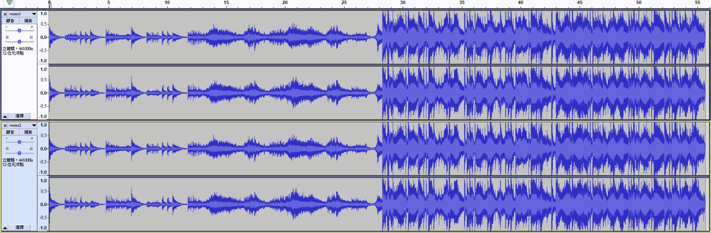
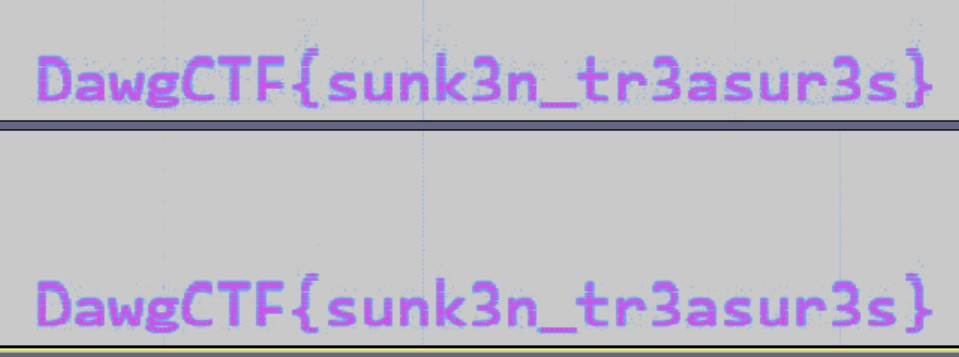

# Moses (175)

### Description
> If you can find a way to part the waves, you might find something on the seafloor.

### File
* [moses](./File/moses.zip)

### Tool
* Audacity

### Solution
1. Look at the two files
    
    * They look very similar
    * We should start by finding out the difference
2. To do so, first select one track and apply Invert effect, then select both tracks and Mix and Render, and finally export as a new track
    
3. View the spectrogram of the new track and get the flag
    
### Flag
```
DawgCTF{sunk3n_tr3asur3s}
```