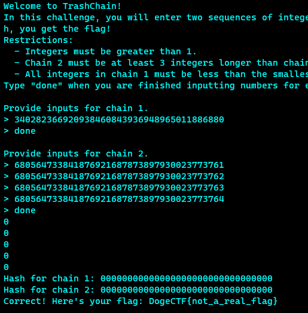

# TrashChain (250)

### Description
> It seems that my problems with hashing just keep multiplying...

### Connection
```shell
nc umbccd.io 3100
```

### File
* [trashchain.py](./File/trashchain.py)

### Tool

### Solution
1. Analyzing the given python file
2. To get the flag we need to submit two sets of values and the hash output should be same
    ```python
    if hashes[0] == hashes[1]:
        print("Correct! Here's your flag: DogeCTF{not_a_real_flag}")
    ```
3. Analyzing the hash functions
    ```python
    # Hash constants
    A = 340282366920938460843936948965011886881
    B = 127605873542257115442148455720344860097

    # Hash function
    def H(val, prev_hash, hash_num):
        return (prev_hash * pow(val + hash_num, B, A) % A)
    
    # Compute hashes
    hashes = []
    for chain_num in range(len(chains)):
        cur_hash = 1
        for i, val in enumerate(chains[chain_num]):
            cur_hash = H(val, cur_hash, i+1)
        hashes.append(cur_hash)
    ```
    * The critical part is that the previous hash value will multiply with the current hash value in the same set
    * The easiest method to make the hash value same is to multiply with 0, so no matter what the other inputs were, the output is always 0
4. Output of function H should be zero, i.e., pow(val + hash_num, B, A)%A = 0
    * val + hash_num is multiple of A
5. Choose the number for sets
    * [A-1]
    * [2A-1, 2A, 2A+1, 2A+2]
6. Get the flag\
    

### Flag
```
DawgCTF{We1rd_RSA_2nd_Pre1m4g3_th1ng}
```
