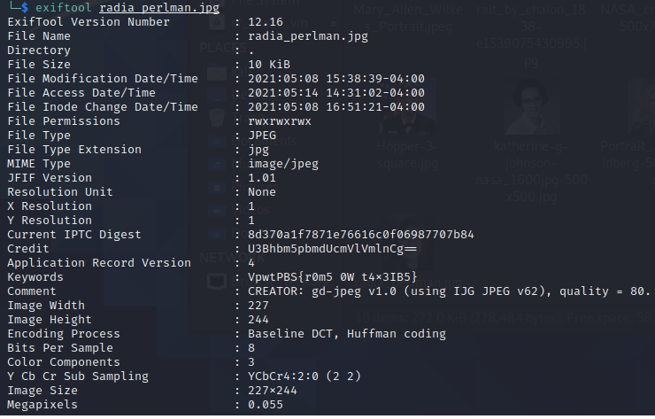

# These Ladies Paved Your Way (150)

### Description
> Per womenintech.co.uk, these 10 women paved your way as technologists. One of them holds more than 100 issued patents and is known for writing understandable textbooks about network security protocols. What other secrets does she hold?

### File
* [WomenInTech](./File/WomenInTech)

### Tool
* exiftool
* [CyberChef](https://gchq.github.io/CyberChef/#recipe=Vigen%C3%A8re_Decode('SpanningTreeVig')&input=VnB3dFBCU3tyMG01IDBXIHQ0eDNJQjV9)

### Solution
1. Check all the images with exiftool only [one](File/WomenInTech/images/radia_perlman.jpg) of them has special information\
    
    * Notice that the Credit looks like base64 encrypted and the Keywords has the same format as our flag
2. Decrypt Credit using base64
    * SpanningTreeVig
3. Decrypt Keywords using Vigenère Cypher
    * Key = Credit = SpanningTreeVig


### Flag
```
DawgCTF{l0t5 0F p4t3NT5}
```