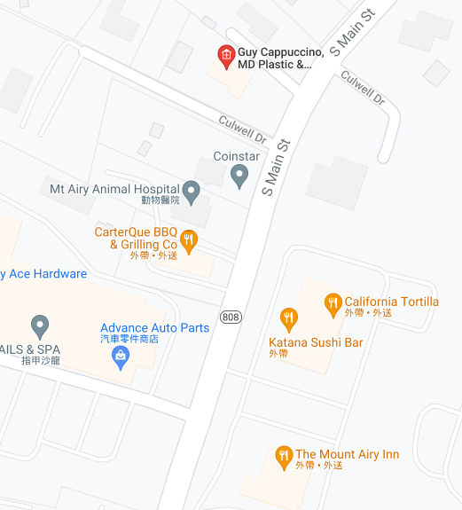
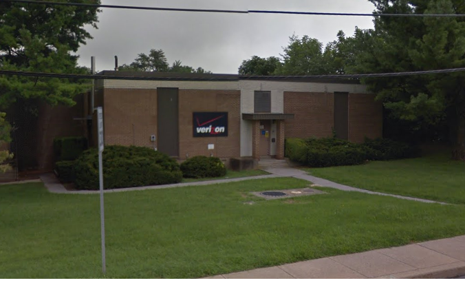
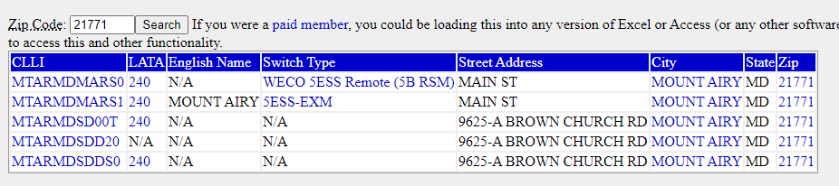

# Identifications (125)

### Description
> Hey man. I'm standing in front of this Verizon central office building. What's its CLLI code?
>
> What? No, I don't know where I am, my GPS is broken. I tried to connect to some Wi-Fi so I could download a map or something, but I don't know the password to any of these networks.
> Once you figure out the CLLI code, make sure to wrap it in DawgCTF{}.

### File
* [identifications](./File/identifications)

### Solution
1. Analyze the SSID in the laptop\
    
    * Some of them are readable strings, focus on those SSID and try to figure where is the location on google map
2. I choose DrCappuccino as my target due to the amounts of the stores are small\
    
    * There's only one result and we can see there is also Katana Sushi Bar near the DrCappuccino, which prove our guess
3. Use google map to figure out where is Verizon
    
    * It's actually at the opposite of DrCappuccino
    * 1305 MD-808 Mt Airy, MD 21771
4. [Search CLLI](https://www.telcodata.us/search-switches-by-zip-code?zip=21771) by zip code 21771
    
    * There are only five results, just try all of them and get the flag

### Flag
```
DawgCTF{MTARMDMARS1}
```