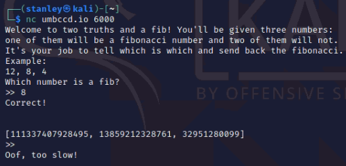

# Two Truths and a Fib (100)

### Description
> Can you catch the fibber?

### Connection
```
nc umbccd.io 6000
```



### Solution
1. A positive integer x is a Fibonacci number if and only if $5x^2+4$ is a perfect square or $5x^2-4$ is a perfect square ([Identification of Fibonacci number](https://en.wikipedia.org/wiki/Fibonacci_number#Identification))
2. Write a python file to interact with server and get the flag

### Flag
```
DawgCTF{jU$T_l1k3_w3lc0me_w33k}
```