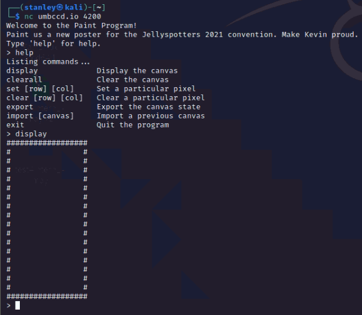
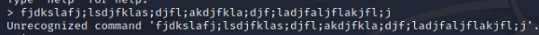
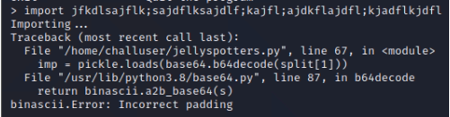

# Jellyspotters (100)

### Description
> The leader of the Jellyspotters has hired you to paint them a poster for their convention, using this painting program. Also, the flag is in ~/flag.txt.

### Connection
```
nc umbccd.io 4200
```


### Solution
1. Use fuzzing to determine how the server dealed with user input
2. try without following the comment\
    
    * The input won't be recognized
3. try with set, clear commands\
    
    * raise ValueError, which is a reasonable error with given input
4. try with import command\
    
    * It uses [pickle](https://docs.python.org/3.6/library/pickle.html) module and base64 for decoding
5. Search for [vulnerability of using pickle](https://dan.lousqui.fr/explaining-and-exploiting-deserialization-vulnerability-with-python-en.html)
    * It turns out that pickle is used for serialization/deserialization and also provides a way to execute arbitrary command
6. PoC
   * Create a pickle object by a customized class with malicious command in __reduce__
   * base64 encrypt the object and send the code to server
   * Get the flag

### Flag
```
DawgCTF{funn13st_s#$&_ive_3v3r_s33n}
```