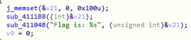
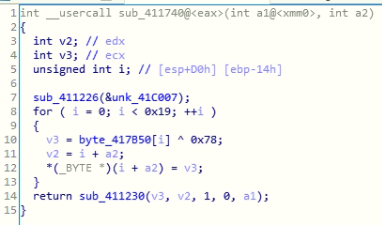
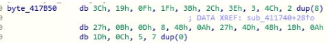

# Secret App (50)

### Description
> I hid my flag in a secret app but I forgot what my username and password are.

### File
* secret_app.exe

### Tool
* IDA Pro

### Solution
1. Follow the same step in [Calculator](../Calculator) and find out the similar functions sub41104B and sub_4111B8\
    
2. sub_4111B8
    * It calls sub_411740 immediately
3. sub_411740\
    
    * The process is similar to [Calculator](../Calculator)
    * byte_417B50\
        
    * Write a python file similar to [Calculator](../Calculator) with different input to get the flag

### Flag
```
DawgCTF{4pp_sup3r_53cret}
```