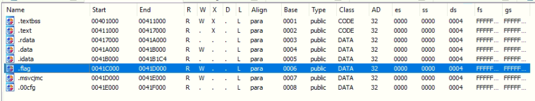
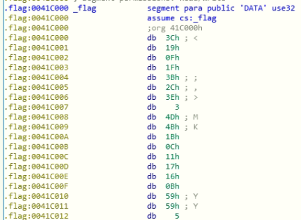

# Sections (75)

### Description
> I hid my flag in a... oh you get the point by now

### File
* sections.exe

### Tool
* IDA Pro

### Solution
1. According to the title and description, the process should be similar to the previous challenges, while the input may be hidden in the section of sections.exe
2. View the sections of section by typing Shift+F7 and find out that there is a section named .flag\
    
    
3. Follow the same step in [Calculator]() to get the flag

### Flag
```
DawgCTF{53ctions!!}
```