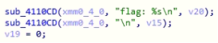
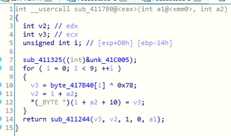
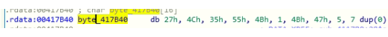
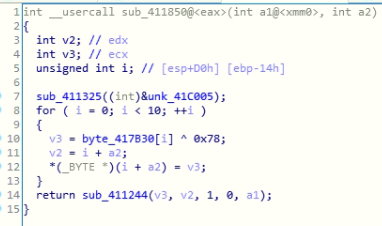
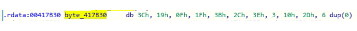

# Who am I? (100)

### Description
> I hid my flag in this program but it seems to have forgot who it is?

### File
* who_am_i.exe

### Tool
* IDA Pro

### Solution
1. Follow the same step in [Calculator](../Calculator), and find the similar function sub_411AD0\
    
2. While the function is different comparing to previous challenges, the concept is same\
   What we really care about is the value in v20, so it's necessary to find out which functions are related to v20\
   By analyzing sub_411AD0, there are three functions sub_411244, sub_411352, sub_41135C which is related to v20 respectively\
   Among them, only sub_4117B0 and sub_411850 changes the value in v20
3. sub_4117B0\
    
    * byte_417B40\
            
4. sub_411850\
    
    * byte_417B30\
        
5. Follow the same step in [Calculator](../Calculator) and notice that sub_411850 are actually executed before sub_4117B0\
   Also mind the range of variable i
6. Concatenate the result to get the flag

### Flag
```
DawgCTF{hU_4M-3y3?}
```