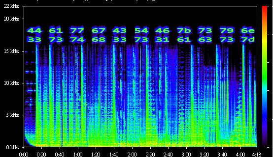

# Third Eye (75)

### Description
> This beat is making me see things that I didn't think I could see...

### File
* [third_eye.mp3](./File/third_eye.mp3)

### Tool
* Spek

### Solution
1. View the spectrogram of mp3 file
    
2. Convert the hex value to char and get flag

### Flag
```
DawgCTF{syn3sth3s1acs}
```