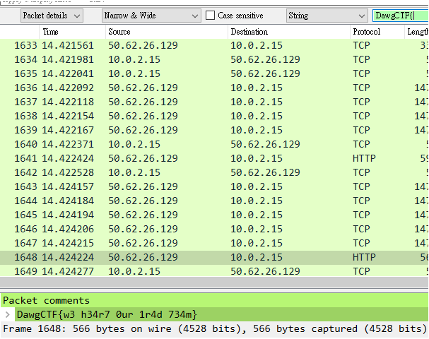

# Just A Comment (50)

### Description
> Just a comment, we love our people here at ClearEdge!

### File
* [justacomment.pcapng](./File/justacomment.pcapng)

### Tool
* Wireshark
### Solution
1. Use Wireshark to search for pattern 'DawgCTF' in packet details
    

### Flag
```
DawgCTF{w3 h34r7 0ur 1r4d 734m}
```
