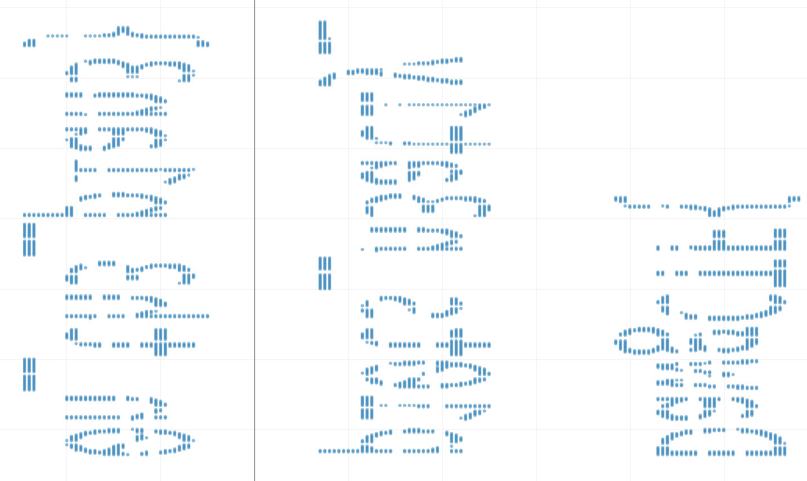
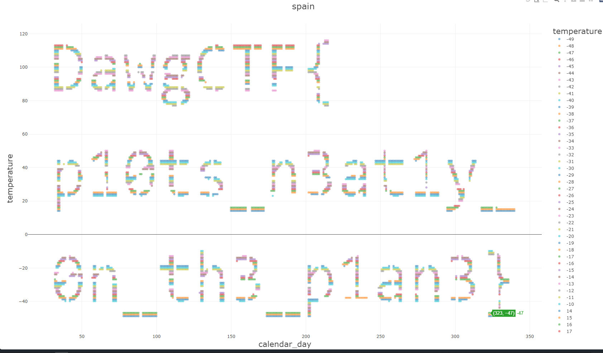

# The Rain in Spain (100)

### Description
> I installed this cool IoT-enabled weathervane on my boat for sailing around Málaga, but the sensors seem to be giving erratic readings...

### Tool
* [csvplot](https://www.csvplot.com/)

### File
* [spain.csv](./File/spain.csv)

### Solution
1. ploct csv using [csvplot](https://www.csvplot.com/)
    
    * It seems like the flag with wrong direction
2. Change the coordination to make it more readable
    

### Flag
```
DawgCTF{p10ts_n3at1y_0n_th3_p1an3}
```