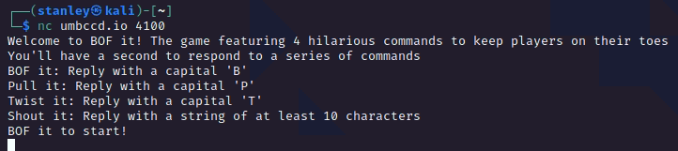
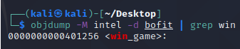
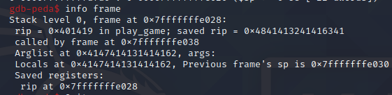
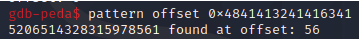

# Bofit (125)

### Description
> Because Bop It is copyrighted, apparently

### Connection
```
nc umbccd.io 4100
```


### File
* [bofit](./File/bofit)
* [bofit.c](./File/bofit.c)

### Solution
1. Analyze [bofit.c](./File/bofit.c)
    * It use gets() function which is vulnerable to buffer overflow attack
        ```c
        printf("Shout it!\n");
        gets(input);
        if(strlen(input) < 10) correct = false;
        break;
        ```
2. To get the flag we need to direct control flow to win_game()
    ```c
    void win_game(){
        char buf[100];
        FILE* fptr = fopen("flag.txt", "r");
        fgets(buf, 100, fptr);
        printf("%s", buf);
    }
    ```
3. Use buffer overflow in gets() function to modify the return address and make the program return to win_game()
4. Use objdump to check the address of win_game()\
    
    * 0x401256
5. Use gdb-peda to check the offset from buffer to the return address
    * ```pattern create 100``` to create a random string with length 100\
        
    * After receiving "Shout it!\n", send the pattern to overflow the stack\
        
    * ```info frame``` to check whether saved rip address(return address) was modified by pattern\
        
    * ```pattern offset <saved rip address>``` to get the offset\
        
        * offset = 56
6. Now we can create payload
    * ```payload = <random character>*offset + <address of win_game()>```
    * the address of win_game() should be little endian, use p32/p64 in pwntools to transfer

### Flag
```
DawgCTF{n3w_h1gh_sc0r3!!}
```