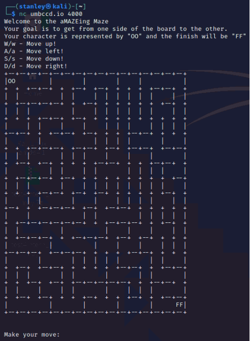
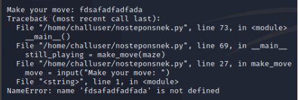
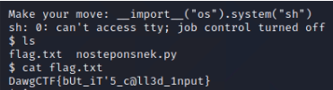

# No Step On Snek (75)

### Description
> I heard you guys like python pwnables\
> ps The source code was released after the challenges ended

### Connection
```
nc umbccd.io 4000
```


### Solution
1. According to the description, it's about python pwnables
2. Use fuzzing to see how would the server deal with invalid input\
    
    * Since the error is NameError, our input is evaluated as python code
3. Try to execute linux command through python code
    * Use [builtin](https://docs.python.org/3/library/functions.html) python functions only, so it won't need to be imported to use
    * There is \_\_import\_\_() builtin function for us to import prefer packages
    * Python allows us to immediately execute a shell command that's stored in a string using the os.system() function
    * payload\
        ```__import__("os").system("sh")```
        * This will retrurn a shell and we can start searching for flag
4. Search for flag\
    

### Flag
```
DawgCTF{bUt_iT'5_c@ll3d_1nput}
```