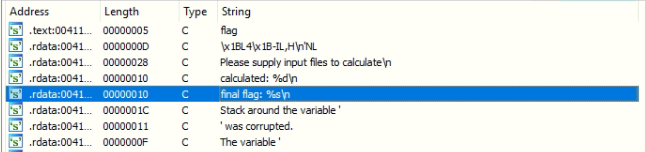
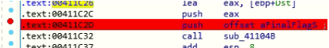
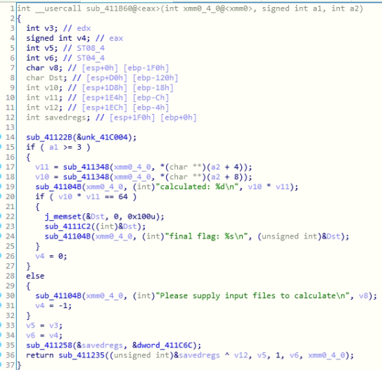
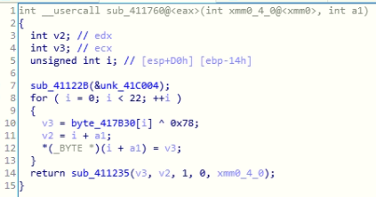
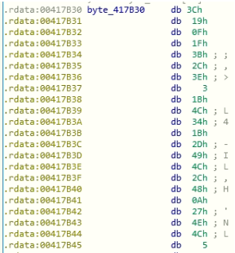
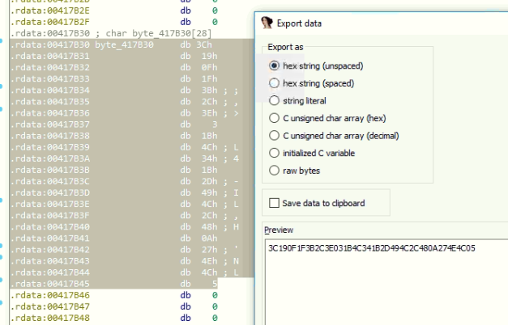

# Calculator (50)

### Description
> I hid my flag in a calculator but I forgot what the magic number is...

### File
* calculator.exe

### Tool
* IDA Pro

### Solution
1. Search through strings and find out there is an interesting string "final flag: %s \n"\
    
2. Follow the string to the reference\
   
3. Generate pseudo code\
    
    * The string and Dst are parameters to function sub_41104B
    * Dst is also parameter to j_memset and sub_4111C2
4. j_memset
   * This function is equivalent to memset
   * It allocates 0x100 spaces to Dst
5. sub_4111C2
    * It calls sub_411760 immediately
6. sub_411760\
    
    * a1 = Dst
    * byte_417B30[0]~byte_417B30[21] are all xored with 0x78\
        
    * Select the whole byte_417B30 and click Edit->Export data to get the raw data\
        
    * write a [python file](./solve.py) to emulate the function and get the flag

### Flag
```
DawgCTF{c4LcU14T0r_64}
```
