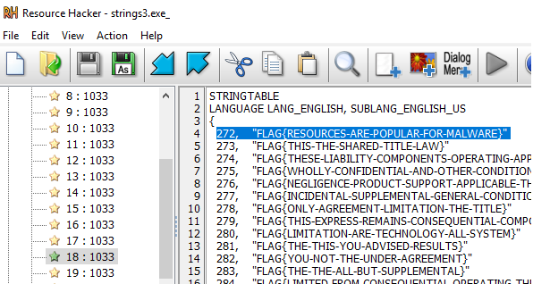

# Static Analysis
* All challenges are designed to be completed without using a debugger. Your goal should be to be able to complete each challenge without running the exe.
## Hide and Seek
### strings1
* start function (0x4022B0)
    ```c
    void __noreturn start()
    {
    char *v0; // ST10_4

    v0 = md5_hash(off_432294);
    MessageBoxA(0, v0, "We've been compromised!", 48);
    ExitProcess(0);
    }
    ```
    * ```off_432294``` = FLAG{CAN-I-MAKE-IT-ANYMORE-OBVIOUS}
* Flag
  * ```FLAG{CAN-I-MAKE-IT-ANYMORE-OBVIOUS}```
### strings2
* start function (0x4022B0)
    ```c
    void __noreturn start()
    {
    char v0[36]; // [esp+0h] [ebp-28h]
    char *v1; // [esp+24h] [ebp-4h]

    v0[0] = 'F';
    v0[1] = 'L';
    v0[2] = 'A';
    v0[3] = 'G';
    v0[4] = '{';
    v0[5] = 'S';
    v0[6] = 'T';
    v0[7] = 'A';
    v0[8] = 'C';
    v0[9] = 'K';
    v0[10] = '-';
    v0[11] = 'S';
    v0[12] = 'T';
    v0[13] = 'R';
    v0[14] = 'I';
    v0[15] = 'N';
    v0[16] = 'G';
    v0[17] = 'S';
    v0[18] = '-';
    v0[19] = 'A';
    v0[20] = 'R';
    v0[21] = 'E';
    v0[22] = '-';
    v0[23] = 'B';
    v0[24] = 'E';
    v0[25] = 'S';
    v0[26] = 'T';
    v0[27] = '-';
    v0[28] = 'S';
    v0[29] = 'T';
    v0[30] = 'R';
    v0[31] = 'I';
    v0[32] = 'N';
    v0[33] = 'G';
    v0[34] = 'S';
    v0[35] = '}';
    v1 = md5_hash(v0);
    MessageBoxA(0, v1, "We've been compromised!", 48);
    ExitProcess(0);
    }
    ```
* Flag
  * ```FLAG{STACK-STRINGS-ARE-BEST-STRINGS}```
### strings3
* start function (0x402290)
    ```c
    void __noreturn start()
    {
    char v0; // [esp+0h] [ebp-4A0h]
    char Dst; // [esp+1h] [ebp-49Fh]
    char *v2; // [esp+404h] [ebp-9Ch]
    char v3; // [esp+408h] [ebp-98h]
    int v4; // [esp+498h] [ebp-8h]
    int v5; // [esp+49Ch] [ebp-4h]

    MD5::MD5((MD5 *)&v3);
    v0 = 0;
    memset(&Dst, 0, 0x3FFu);
    v5 = 0;
    v4 = FindResourceA(0, "rc.rc", 6);
    v5 = 272;
    LoadStringA(0, 272, &v0, 1023);
    v2 = MD5::digestString((MD5 *)&v3, &v0);
    MessageBoxA(0, v2, "We've been compromised!", 48);
    ExitProcess(0);
    }
    ```
    * The identifier of the string is 272
    * We can find out the value of string resource by [Resource Hacker](http://www.angusj.com/resourcehacker/)
      
* Flag
  * ```FLAG{RESOURCES-ARE-POPULAR-FOR-MALWARE}```
## Shellcode
### shellcode1
* start function (0x402270)
    ```c
    void __noreturn start()
    {
    int v0; // eax
    int v1; // ST08_4
    int v2; // ST0C_4
    size_t v3; // eax
    void *Dst; // ST14_4
    char *v5; // ST18_4
    char v6; // [esp+Ch] [ebp-98h]
    _DWORD *v7; // [esp+A0h] [ebp-4h]

    MD5::MD5((MD5 *)&v6);
    v0 = GetProcessHeap(0, 16);
    v7 = (_DWORD *)HeapAlloc(v0, v1, v2);
    *v7 = Str;
    v3 = strlen(Str);
    v7[1] = v3;
    Dst = (void *)VirtualAlloc(0, 13, 4096, 64);
    memcpy(Dst, &unk_404068, 0xDu);
    ((void (*)(void))Dst)();
    v5 = MD5::digestString((MD5 *)&v6, Str);
    MessageBoxA(0, v5, "We've been compromised!", 48);
    ExitProcess(0);
    }
    ```
  * Since ```Dst``` is called as function and it's value is copied from ```unk_404068```, ```unk_404068``` must be assembly code
* Cursor points to ```unk_404068``` and press ```p``` to define function on this address<br>
  
  
* sub_404068
  ```c
    void __usercall sub_404068(int *a1@<esi>)
    {
        int v1; // edi
        int v2; // ecx

        v1 = *a1;
        v2 = a1[1];
        do
        {
            *(_BYTE *)(v1 + v2 - 1) = __ROL1__(*(_BYTE *)(v1 + v2 - 1), 5);
            --v2;
        }
        while ( v2 );
    }
  ```
  * v1 is the ```Str```
  * v2 is the length of ```Str```
  * This function is doing left shift on each byte of ```Str``` for 5 bits
* sub_404068 implemented in python
  ```python
  def rol(bit, shift):
      # unit is byte
      bit = bin(bit)[2:].rjust(8,'0')
      return int(bit[shift:]+bin[:shift], 2)
  Str = [0x32, 0x62, 0x0A, 0x3A, 0xDB, 0x9A, 0x42, 0x2A, 0x62, 0x62, 
  0x1A, 0x7A, 0x22, 0x2A, 0x69, 0x4A, 0x9A, 0x72, 0xA2, 0x69, 
  0x52, 0xAA, 0x9A, 0xA2, 0x69, 0x32, 0x7A, 0x92, 0x69, 0x2A, 
  0xC2, 0x82, 0x62, 0x7A, 0x4A, 0xA2, 0x9A, 0xEB]
  flag = ""
  for c in Str:
      flag += chr(rol(c, 5))
  ```
* Flag
  * ```FLAG{SHELLCODE-ISNT-JUST-FOR-EXPLOITS}```
### shellcode2
* start function (0x402270)
    ```c
    v0 = GetProcessHeap(0, 16);
    v7 = HeapAlloc(v0, v1, v2);
    *v7 = LoadLibraryA;
    v7[1] = GetProcAddress;
    v7[2] = v6;
    v7[3] = 36;
    Dst = VirtualAlloc(0, 584, 4096, 64);
    memcpy(Dst, sub_404040, 0x248u);
    (Dst)(v7);
    v4 = MD5::digestString(&v5, v6);
    MessageBoxA(0, v4, "We've been compromised!", 48);
    ExitProcess(0);
    ```
    * ```v6``` contains stack string
* sub_404040 (0x404040)
    ```c
    LoadLibraryA = *a1;
    GetProcAddress = *(a1 + 4);
    msvcrt.dll = LoadLibraryA(&str_msvcrt.dll);
    kernel32.dll = LoadLibraryA(&str_kernel32.dll);
    GetModuleFileNameA = GetProcAddress(kernel32.dll, &str_GetModuleFileNameA);
    fopen = GetProcAddress(msvcrt.dll, &str_fopen);
    fseek = GetProcAddress(msvcrt.dll, &str_fseek);
    fread = GetProcAddress(msvcrt.dll, &str_fread);
    fclose = GetProcAddress(msvcrt.dll, &str_fclose);
    GetModuleFileNameA(0, &cur_proc, 260);
    fd = fopen(&cur_proc, &str_rb);
    fseek(fd, 0x4E, SEEK_SET);
    fread(v79, 0x26, 1, fd);
    result = fclose(fd);
    int_36 = *(a1 + 12);
    buf = *(a1 + 8);
    i = 0;
    do
    {
        LOBYTE(result) = v79[i];
        *(buf + i++) ^= result;
    }
    while ( i != int_36 );
    return result;
    ```
    * This function has lots of stack strings, and I've sorted out all of them, and rename each variables to make a better view of the pseudo code
    * ```buf``` = ```v6``` in previous start function
    * To get the value of ```v79```, we need to know what is the value of current's process at offset ```0x4E``` with length ```0x26```
    * Since this is an executable file, offset 0x4E is the string in the ```DOS STUB``` which is readable for human, i.e., ```This program cannot be run in DOS mode```, which is exactly 0x26 bytes
* decryption
    ```python
    buf = [18,36,40,52,91,35,38,32,53,55,76,40,118,38,51,55,58,39,61,110,37,72,111,60,88,58,104,44,67,115,16,14,16,107,16,111]
    v79 = "This program cannot be run in DOS mode"
    flag = ""
    for a,b in zip(buf,v79):
        flag += chr(a^ord(b))
    ```
* Flag
  * ```FLAG{STORE-EVERYTHING-ON-THE-STACK}```

## De-virtualization
### vm1
* start function (0x402370)
    ```c
    void __noreturn start()
    {
    int v0; // eax
    int v1; // ST08_4
    int v2; // ST0C_4
    char *v3; // ST10_4
    char v4; // [esp+4h] [ebp-90h]

    MD5::MD5((MD5 *)&v4);
    v0 = GetProcessHeap(0, 507);
    Dst = (char *)HeapAlloc(v0, v1, v2);
    memcpy(Dst, &unk_404040, 0x1FBu);
    sub_4022E0();
    v3 = MD5::digestString((MD5 *)&v4, Dst);
    MessageBoxA(0, v3, "We've been compromised!", 48);
    ExitProcess(0);
    }
    ```
    * The value of ```Dst``` is copied from ```unk_404040``` with length ```0x1FB```
* sub_4022E0 (0x4022E0)
    ```c
    int sub_4022E0()
    {
    int param1; // ST0C_4
    unsigned __int8 v1; // ST1B_1
    int param2; // ST10_4
    char param3; // ST14_1
    int result; // eax
    unsigned __int8 v5; // [esp+Fh] [ebp-1h]

    v5 = 0;
    do
    {
        param1 = (unsigned __int8)Dst[v5 + 255];
        v1 = v5 + 1;
        param2 = (unsigned __int8)Dst[v1++ + 255];
        param3 = Dst[v1 + 255];
        v5 = v1 + 1;
        result = sub_402270(param1, param2, param3);
    }
    while ( (_BYTE)result );
    return result;
    }
    ```
    * This part is taking values from ```Dst``` array, and send them as parameters to ```sub_402270```
    * It'll break out the while loop according to the return value of ```sub_402270```
* sub_402270 (0x402270)
  ```c
    char __stdcall sub_402270(int CASE, int inde, char value)
    {
    switch ( CASE )
    {
        case 1:
        Dst[inde] = value;
        break;
        case 2:
        byte_404240 = Dst[inde];                  // byte_404240 = Dst[1]
        break;
        case 3:
        Dst[inde] ^= byte_404240;
        break;
        default:
        return 0;
    }
    return 1;
    }
    ```
    * This function is modifying the value stored in ```Dst``` according to the parameters
    * ```byte_404240``` is actually at the same location as ```Dst[1]```<br>
      
* We can simulate the these functions to figure out what's the result of ```Dst```<br>
  
* Flag
  * ```FLAG{VMS-ARE-FOR-MALWARE}```
## Ransomware
### ransomware1
* We get one encrypted flag file and eight encrypted jpg files, if the file extension doesn't lie
* sub_401000
    ```c
    int __cdecl sub_401000(int a1, int a2)
    {
    unsigned int i; // [esp+0h] [ebp-111Ch]
    char v4[4100]; // [esp+4h] [ebp-1118h]
    int file_encrypt; // [esp+1008h] [ebp-114h]
    unsigned int length; // [esp+100Ch] [ebp-110h]
    int file_origin; // [esp+1010h] [ebp-10Ch]
    char s; // [esp+1014h] [ebp-108h]

    snprintf(&s, 0x104u, "%s_encrypted", victim);     // flag.txt
    file_origin = CreateFileA(victim, 0x80000000, 0, 0, 3, 0x80, 0);
    file_encrypt = CreateFileA(&s, 0x40000000, 0, 0, 2, 0x80, 0);
    do
    {
        if ( ReadFile(file_origin, v4, 4096, &length, 0) != 1 )
        break;
        for ( i = 0; i < length; ++i )
        v4[i] ^= *(_BYTE *)(key + i % 0x20);
        WriteFile(file_encrypt, v4, length, &length, 0);
    }
    while ( length == 4096 );
    CloseHandle(file_origin);
    return CloseHandle(file_encrypt);
    }
    ```
    * This is the main function that's doing encryption
    * It's doing xor bytes by bytes with a key whose length is 0x20
* Decryption
  * The flag always starts with ```FLAG{```
  * The flag always ends with ```}```
  * If the ```.jpg``` extension does not lie, there're some [file signatures](https://www.file-recovery.com/jpg-signature-format.htm) that we can leveraged to solve part of the key
    * The file always starts with ```FF D8 FF E0 UNKNOWN UNKNOWN 4A 46 49 46 00```
    * The file always ends with ```FF D9```
  * Within these information, we can recover part of the key and flag
    * ```FLAG{.OR-MAKE.....WN-PLA..TE.T-ÃND-FR.QUENCY-.....SIS-EA..}```
  * Next we can assume that ```FR.QUENCY``` is actually ```FREQUENCY``` which is the only word that makes sense
    * ```FLAG{XOR-MAKE.....WN-PLA..TE.T-ÃND-FREQUENCY-.....SIS-EA..}```
  * We also know that ```PLA..TE.T``` is ```PLAINTEXT``` by searching with some [online tools](https://wordfinder.yourdictionary.com/letter-words/9-starts-pla-with-te-ends-t/), and figure out that this is the only word that matches the pattern
    * ```FLAG{XOR-MAKE.....WN-PLAINTEXT-ÃND-FREQUENCY-.....SIS-EASY}```
  * The next step is more like guessing, but with enough reason
    * ```.....SIS``` -> ```ANALYSIS```, since ```frequency analysis``` is a reasonable term used in this condition
    * ```FLAG{XOR-MAKES-KNOWN-PLAINTEXT-ÃND-FREQUENCY-ANALYSIS-EASY}```
  * It seems that we've got the flag, but be careful of ```Ã``` which is not ```A```
    * In this case, it definitely should be ```A```
* Flag
  * ```FLAG{XOR-MAKES-KNOWN-PLAINTEXT-ÃND-FREQUENCY-ANALYSIS-EASY}```