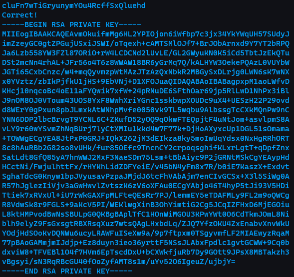
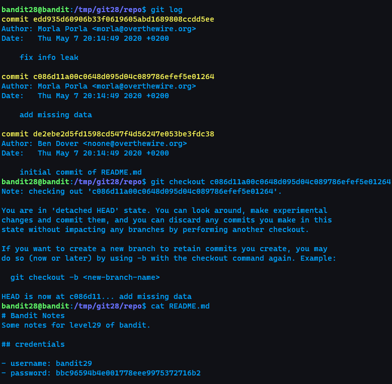

# OverTheWire witeup
## [Bandit](https://overthewire.org/wargames/bandit/)
* For absolute beginners
### Level 0 & Level 0 -> Level 1

* [```ssh```](https://man7.org/linux/man-pages/man1/ssh.1.html)
  * ```-l [login_name]```
  * ```-p [port]```
* payload
  * ```ssh bandit.labs.overthewire.org -p 2220 -l bandit0```
  * password: ```bandit0```
### Level 1 -> Level 2

* [```-```](https://unix.stackexchange.com/questions/16357/usage-of-dash-in-place-of-a-filename)
  * It's a convention to use ```-``` as a filename to mean stdin/stdout<br>
    
  * When ```cat``` sees the string ```-``` as a filename, it treats it as a synonym for stdin
  * Alter the string that ```cat``` sees in such a way that it still refers to a file called ```-```
    * Absolute path
    * Relative path
      * Needs to add ```./``` as prefix if the user and the target file is under the same folder
* payload
  * ```cat ./-```
### Level 2 -> Level 3

* payload
  * ```cat "spaces in this filename"```
### Level 3 -> Level 4

* [```ls```](https://man7.org/linux/man-pages/man1/ls.1.html)
  * ```-l```
    * use a long listing format
    * column
      * permissions
      * number of linked hard-links
      * owner of the file
      * to which group this file belongs to
      * size
      * modification/creation date and time
      * file/directory name
  * ```-a```
    * do not ignore entries starting with ```.```
* payload
  * ```cat .hidden```
### Level 4 -> Level 5

* payload
  * ```cat ./-file07```
### Level 5 -> Level 6

* [```find```](https://man7.org/linux/man-pages/man1/find.1.html)
  * ```-size [n]```
    * File uses less than, more than or exactly n units of space, rounding up.
    * Suffixes
      * ```b```
        * for 512-byte blocks
        * default
      * ```c```
        * for bytes
      * ```w```
        * for two-byte words
      * ```k```
        * for kibibytes (KiB)
      * ```M```
        * for mebibytes (MiB)
      * ```G```
        * for gibibytes (GiB)
  * ```-executable```
    * Matches files which are executable and directories which are searchable (in a file name resolution sense) by the current user.
* [```!```](https://bash.cyberciti.biz/guide/Logical_Not_!)
  * Logical Not
* [``` `[cmd]` ```](https://stackoverflow.com/questions/8663595/bash-for-inline-command)
  * Bash inline command
* payload
  * ```cat `find . -size 1033c ! -executable` ```
### Level 6 -> Level 7

* payload
  * ```ls -la `find . -size 33c`| grep bandit6 | grep bandit7```
  * ```cat ./var/lib/dpkg/info/bandit7.password```
### Level 7 -> Level 8

* payload
  * ```cat data.txt | grep millionth```
### Level 8 -> Level 9

* [```uniq```](https://man7.org/linux/man-pages/man1/uniq.1.html)
  * Filter **adjacent** matching lines from INPUT (or standard input), writing to OUTPUT (or standard output).
  * ```-u```
    * only print unique lines
* [```sort```](https://man7.org/linux/man-pages/man1/sort.1.html)
* payload
  * ```sort data.txt | uniq -u```
### Level 9 -> Level 10

* payload
  * ```strings data.txt | grep =```
### Level 10 -> Level 11

* [```base64```](https://man7.org/linux/man-pages/man1/base64.1.html)
  * Base64 encode or decode FILE, or standard input, to standard output.
  * ```-d```
    * decode data
* payload
  * ```cat data.txt | base64 -d```
### Level 11 -> Level 12

* [```tr```](https://man7.org/linux/man-pages/man1/tr.1.html)
  * Translate, squeeze, and/or delete characters from standard input, writing to standard output.
* The inverse function of ROT13 is itself
* payload
  * ```tr 'A-Za-z' 'N-ZA-Mn-za-m' < data.txt```
### Level 12 -> Level 13


* [```xxd```](https://linux.die.net/man/1/xxd)
  * ```xxd``` creates a hex dump of a given file or standard input.
  * ```-r```
    * reverse operation: convert (or patch) hexdump into binary.
* [```file```](https://man7.org/linux/man-pages/man1/file.1.html)
  * determine file type
* gzip
  * file extension ```.gz```
  * compress
    * ```gzip [file ...]```
  * decopmress
    * ```gunzip [file]```
    * ```gzip -d [file]```
* bzip2
  * file extension ```bz2```
  * compress
    * ```bzip2 -z [file]```
  * decompress
    * ```bzip2 -d [file]```
    * ```bunzip2 [file]```
* tar
  * file extension ```.tar```
  * compress
    * ```tar -cvf [file.tar] [dir ...]```
  * decompress
    * ```tar -xvf [file]```
* Reference
  * [Common (de)compress command](http://note.drx.tw/2008/04/command.html)
### Leve 13 -> Level 14

* [```scp```](https://unix.stackexchange.com/questions/188285/how-to-copy-a-file-from-a-remote-server-to-a-local-machine)<br>
  
* payload
  * ```ssh -i sshkey.private bandit.labs.overthewire.org -p 2220 -l bandit14```
### Level 14 -> Level 15

* [```nc```](https://man7.org/linux/man-pages/man1/ncat.1.html)
  * Ncat is a feature-packed networking utility which reads and writes data across networks from the command line.
### Level 15 -> Level 16

* payload
  * ```openssl s_client -connect localhost:30001```
* Reference
  * [使用 Openssl 測試指定 SSL 加密法](https://cjk.aiao.today/openssl-specified-encryption-method/)
### Level 16 -> Level 17

* scan for open port<br>
  
* scan for ports using ssl<br>
  
  <br>
  * Although the description says that there's only one port opened with ssl, I actually find two. One of them is the correct port and the other is a port repeating for the user's input
    
* Reference
  * [Using Nmap to check certs and supported TLS algorithms](https://jumpnowtek.com/security/Using-nmap-to-check-certs-and-supported-algos.html)
### Level 17 -> Level 18

* [```diff```](https://man7.org/linux/man-pages/man1/diff.1.html)
  * compare files line by line
* payload
  * ```diff passwords.old passwords.new```
### Level 18 -> Level 19

* payload
  * ```ssh bandit.labs.overthewire.org -p 2220 -l bandit18 cat readme```
* Reference
  * [Executing remote commands on the server](https://www.ssh.com/academy/ssh/command#sec-SSH-Command-in-Linux)
### Level 19 -> Level 20

* Reference
  * [pid / ppid / uid / euid / gid / egid](https://stackoverflow.com/questions/30493424/what-is-the-difference-between-a-process-pid-ppid-uid-euid-gid-and-egid)
### Level 20 -> Level 21

* nc
  * ```-l```
    * Bind and listen for incoming connections
* ```&```
  * Run linux command in background
* [```jobs```](https://man7.org/linux/man-pages/man1/jobs.1p.html)
  * display status of jobs in the current session
### Level 21 -> Level 22

* [Cron Job](http://kejyun.github.io/Laravel-4-Learning-Notes-Books/laravel-cronjob/laravel-cronjob-README.html)
  * [```* * * * *```](https://serverfault.com/questions/162388/what-does-five-asterisks-in-a-cron-file-mean)
    * Every minute of every day of every week of every month, that command runs.
  * ```@reboot```
    * run the command after reboot every time
* ```&>```
  * Redirects both stdout and stderr
### Level 22 -> Level 23

* [```md5sum```](https://man7.org/linux/man-pages/man1/md5sum.1.html)
  * compute and check MD5 message digest
* [```cut```](https://man7.org/linux/man-pages/man1/cut.1.html)
  * remove sections from each line of files
  * ```-d [DELIM]```
    * use DELIM instead of TAB for field delimiter
  * ```-f [LIST]```
    * select only these fields
### Level 23 -> Level 24

### Level 24 -> Level 25

### Level 25 -> Level 26

* Find out what shell is bandit26 using<br>
  
  * It'll log out the client immediately after client logs in
  * The only chance we an stay inside the server is to trigger ```more ~/text.txt```
* [```more```](https://man7.org/linux/man-pages/man1/more.1.html)
  * ```more``` is a filter for paging through text one screenful at a time.
  * To trigger the ```more``` command, we need to make the hight of cmd window smaller than the hight of banner, which is 6<br>
    
    
    * ```ssh -i bandit26.sshkey localhost -l bandit26```
  * After triggering ```more``` command, we're now in the interactive mode of ```more```
  * ```v```<br>
    
    * interactive command
    * Start up an editor at current line.
      * In this case, it's ```vim```
* [```vim```](https://vim.rtorr.com/)<br>
  
  * ```:e[dit] file```
    * edit a file in a new buffer
    * We can leverage this command to edit ```/etc/bandit_pass/bandit26```
### Level 26 -> Level 27

* Use the same technique to login bandit26 and start a ```vim``` editor again
* This time we'd like to set the shell to ```/bin/bash``` to run some unix commands
* [```vim```](https://vimhelp.org/quickref.txt.html)
  * [```:set shell=/bin/bash```](https://vimhelp.org/options.txt.html#%27shell%27)
    * This will set the shell to ```/bin/bash```
  * [```:! [cmd]```](https://vimhelp.org/various.txt.html#%3A%21)
    * This can allow running shell command within ```vim```
### Level 27 -> Level 28

### Level 28 -> Level 29

### Level 29 -> Level 30

### Level 30 -> Level 31

* Reference
  * [git tag](https://gitbook.tw/chapters/tag/using-tag)
### Level 31 -> Level 32


### Level 32 -> Level 33

* ```$0```
  * Expands to the name of the shell or shell script
  * If Bash is invoked with a file of commands (see Shell Scripts), $0 is set to the name of that file.
  * If Bash is started with the -c option (see Invoking Bash), then $0 is set to the first argument after the string to be executed, if one is present. Otherwise, it is set to the filename used to invoke Bash, as given by argument zero.
  * There're two possible values of ```$0``` depending on how this shell is runned
    * ```./uppercase_shell``` -> ```./uppercase_shell```
    * ```sh -c 'uppercase_shell'``` -> ```sh```
  * If it's the seocond case, then we can run a new shell as ```sh``` by typing ```$0``` in the ```uppercase_shell```

* Reference
  * [Bash special parameters](https://www.gnu.org/software/bash/manual/html_node/Special-Parameters.html)
  * [Writeup explanation](https://www.reddit.com/r/hacking/comments/dxe2c2/bandit_level_32_explained_pls_overthewire/)